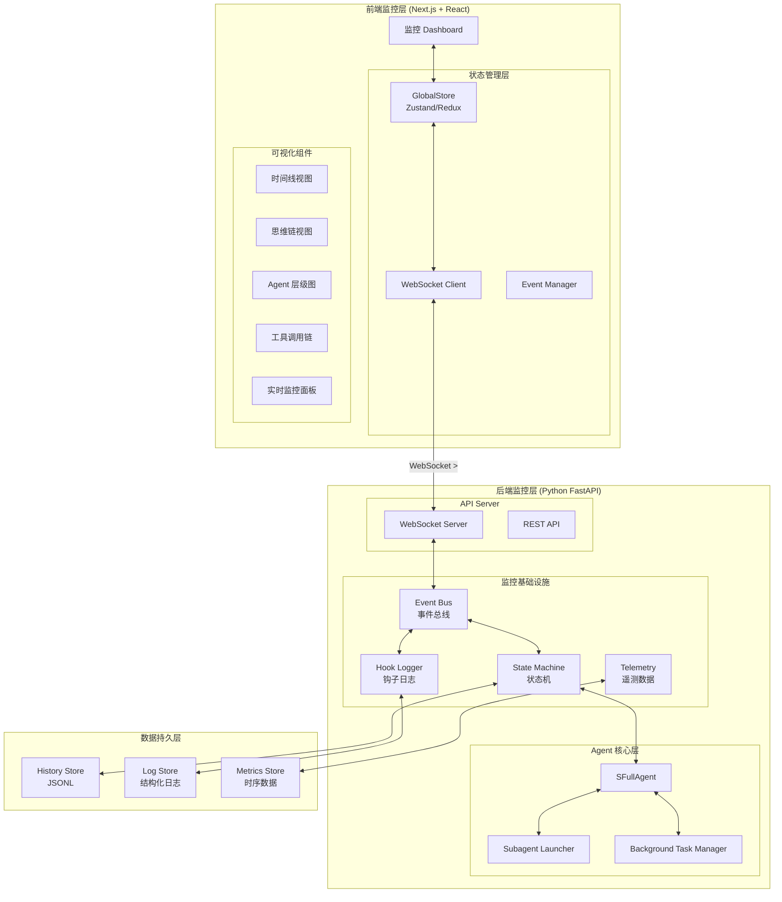
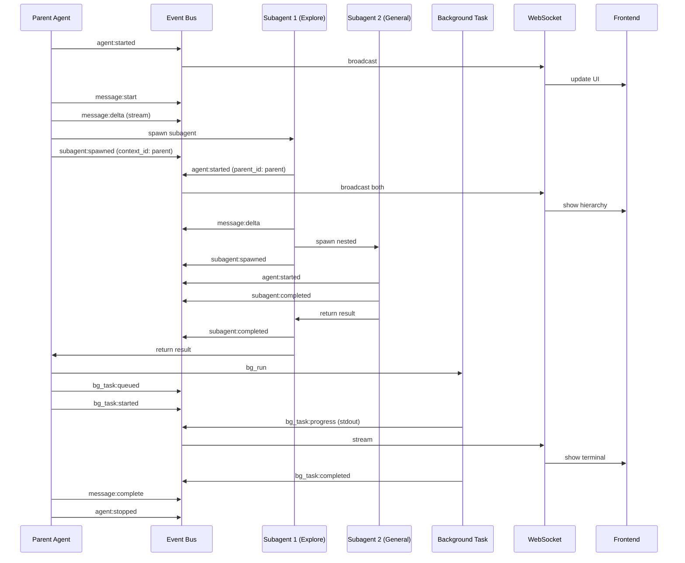

# 智能体监控系统设计文档

## 概述

基于当前前后端架构，设计一个**细粒度智能体监控系统**，实现前端对后端智能体工作过程的完全透明化监控。通过 WebSocket 实时通信和状态机驱动，前端可以监控包括子智能体、后台任务、同步/异步操作在内的所有过程。

---

## 1. 系统架构总览



---

## 2. 核心设计理念

### 2.1 完全透明化 (Full Transparency)
- **零信息丢失**: 每个智能体动作、每个子调用、每个状态变更都被记录和广播
- **层级可追溯**: 支持 Parent-Child 关系追踪，完整呈现调用链
- **时间可回溯**: 支持历史状态回放和断点检查

### 2.2 实时状态同步 (Real-time State Sync)
- **快照 + 增量**: 完整状态快照 + 增量更新混合模式
- **事件驱动**: 基于事件总线的异步通信
- **最终一致性**: 允许短暂延迟，保证最终状态一致

### 2.3 可扩展监控 (Extensible Monitoring)
- **插件化 Hook**: 新监控点通过 Hook 机制动态添加
- **可配置粒度**: 支持从粗粒度到细粒度的监控级别调整
- **多维数据**: 事件、日志、指标三位一体

---

## 3. 后端架构设计

### 3.1 事件总线系统 (Event Bus)

```python
# agents/monitoring/event_bus.py

from enum import Enum
from dataclasses import dataclass, field
from typing import Any, Callable, Optional
from datetime import datetime
import asyncio
from loguru import logger

class EventPriority(Enum):
    CRITICAL = 0   # 系统关键事件：错误、状态变更
    HIGH = 1       # 用户关注事件：消息完成、工具结果
    NORMAL = 2     # 常规事件：token 流、工具调用
    LOW = 3        # 诊断事件：性能指标、调试信息

class EventType(Enum):
    # === Agent 生命周期 ===
    AGENT_STARTED = "agent:started"
    AGENT_STOPPED = "agent:stopped"
    AGENT_ERROR = "agent:error"
    AGENT_PAUSED = "agent:paused"
    AGENT_RESUMED = "agent:resumed"

    # === 消息流事件 ===
    MESSAGE_START = "message:start"
    MESSAGE_DELTA = "message:delta"
    MESSAGE_COMPLETE = "message:complete"
    REASONING_DELTA = "reasoning:delta"

    # === 工具调用事件 ===
    TOOL_CALL_START = "tool_call:start"
    TOOL_CALL_END = "tool_call:end"
    TOOL_CALL_ERROR = "tool_call:error"
    TOOL_RESULT = "tool:result"

    # === 子智能体事件 (新增) ===
    SUBAGENT_SPAWNED = "subagent:spawned"
    SUBAGENT_STARTED = "subagent:started"
    SUBAGENT_PROGRESS = "subagent:progress"
    SUBAGENT_COMPLETED = "subagent:completed"
    SUBAGENT_FAILED = "subagent:failed"

    # === 后台任务事件 (新增) ===
    BACKGROUND_TASK_QUEUED = "bg_task:queued"
    BACKGROUND_TASK_STARTED = "bg_task:started"
    BACKGROUND_TASK_PROGRESS = "bg_task:progress"
    BACKGROUND_TASK_COMPLETED = "bg_task:completed"
    BACKGROUND_TASK_FAILED = "bg_task:failed"

    # === 状态机事件 ===
    STATE_TRANSITION = "state:transition"
    STATE_ENTER = "state:enter"
    STATE_EXIT = "state:exit"

    # === 资源使用事件 ===
    TOKEN_USAGE = "metrics:tokens"
    MEMORY_USAGE = "metrics:memory"
    LATENCY_METRIC = "metrics:latency"

    # === Todo 管理事件 ===
    TODO_CREATED = "todo:created"
    TODO_UPDATED = "todo:updated"
    TODO_COMPLETED = "todo:completed"

@dataclass
class MonitoringEvent:
    """监控事件数据结构"""
    type: EventType
    dialog_id: str
    timestamp: datetime = field(default_factory=datetime.utcnow)
    source: str = ""                    # 事件来源 (agent_name/subagent_name)
    parent_id: Optional[str] = None     # 父事件 ID，用于构建调用链
    context_id: Optional[str] = None    # 上下文 ID，关联一组相关事件
    priority: EventPriority = EventPriority.NORMAL
    payload: dict[str, Any] = field(default_factory=dict)
    metadata: dict[str, Any] = field(default_factory=dict)

    def to_dict(self) -> dict:
        return {
            "type": self.type.value,
            "dialog_id": self.dialog_id,
            "timestamp": self.timestamp.isoformat(),
            "source": self.source,
            "parent_id": self.parent_id,
            "context_id": self.context_id,
            "priority": self.priority.value,
            "payload": self.payload,
            "metadata": self.metadata,
        }

class EventBus:
    """
    异步事件总线

    支持:
    - 发布/订阅模式
    - 事件优先级队列
    - 持久化存储
    - WebSocket 广播
    """

    def __init__(self):
        self._subscribers: dict[EventType, list[Callable]] = {}
        self._global_subscribers: list[Callable] = []
        self._priority_queue: asyncio.PriorityQueue = asyncio.PriorityQueue()
        self._running = False
        self._persistence_handlers: list[Callable] = []
        self._websocket_handler: Optional[Callable] = None

    async def start(self):
        """启动事件处理循环"""
        self._running = True
        asyncio.create_task(self._process_events())

    async def stop(self):
        """停止事件处理"""
        self._running = False

    async def emit(self, event: MonitoringEvent):
        """发布事件"""
        # 优先级队列：(priority, timestamp, event)
        await self._priority_queue.put((
            event.priority.value,
            event.timestamp.timestamp(),
            event
        ))

    async def _process_events(self):
        """处理事件循环"""
        while self._running:
            try:
                priority, timestamp, event = await asyncio.wait_for(
                    self._priority_queue.get(), timeout=1.0
                )

                # 并行处理：广播 + 持久化
                await asyncio.gather(
                    self._broadcast(event),
                    self._persist(event),
                    return_exceptions=True
                )

            except asyncio.TimeoutError:
                continue
            except Exception as e:
                logger.error(f"[EventBus] Error processing event: {e}")

    async def _broadcast(self, event: MonitoringEvent):
        """广播事件到所有订阅者"""
        # WebSocket 广播
        if self._websocket_handler:
            await self._websocket_handler(event)

        # 本地订阅者
        handlers = self._subscribers.get(event.type, [])
        for handler in handlers:
            try:
                await handler(event)
            except Exception as e:
                logger.error(f"[EventBus] Handler error: {e}")

        # 全局订阅者
        for handler in self._global_subscribers:
            try:
                await handler(event)
            except Exception as e:
                logger.error(f"[EventBus] Global handler error: {e}")

    async def _persist(self, event: MonitoringEvent):
        """持久化事件"""
        for handler in self._persistence_handlers:
            try:
                await handler(event)
            except Exception as e:
                logger.error(f"[EventBus] Persistence error: {e}")

    def subscribe(self, event_type: EventType, handler: Callable):
        """订阅特定事件类型"""
        if event_type not in self._subscribers:
            self._subscribers[event_type] = []
        self._subscribers[event_type].append(handler)

    def subscribe_all(self, handler: Callable):
        """订阅所有事件"""
        self._global_subscribers.append(handler)

    def set_websocket_handler(self, handler: Callable):
        """设置 WebSocket 广播处理器"""
        self._websocket_handler = handler

    def add_persistence_handler(self, handler: Callable):
        """添加持久化处理器"""
        self._persistence_handlers.append(handler)

# 全局事件总线实例
event_bus = EventBus()
```

### 3.2 状态机系统 (State Machine)

```python
# agents/monitoring/state_machine.py

from enum import Enum, auto
from dataclasses import dataclass, field
from typing import Any, Optional, Callable
from datetime import datetime
import asyncio

class AgentState(Enum):
    """Agent 状态枚举"""
    IDLE = "idle"                           # 空闲
    INITIALIZING = "initializing"           # 初始化中
    THINKING = "thinking"                   # 思考中 (LLM 调用)
    TOOL_CALLING = "tool_calling"           # 工具调用中
    WAITING_FOR_TOOL = "waiting_for_tool"   # 等待工具结果
    SUBAGENT_RUNNING = "subagent_running"   # 子智能体运行中
    BACKGROUND_TASKS = "background_tasks"   # 后台任务执行中
    PAUSED = "paused"                       # 暂停
    COMPLETED = "completed"                 # 完成
    ERROR = "error"                         # 错误

class StateTransition:
    """状态转换定义"""
    def __init__(
        self,
        from_state: AgentState,
        to_state: AgentState,
        condition: Optional[Callable] = None,
        on_transition: Optional[Callable] = None
    ):
        self.from_state = from_state
        self.to_state = to_state
        self.condition = condition
        self.on_transition = on_transition

@dataclass
class StateContext:
    """状态上下文"""
    state: AgentState
    entered_at: datetime
    data: dict[str, Any] = field(default_factory=dict)
    substates: list['StateContext'] = field(default_factory=list)
    parent: Optional['StateContext'] = None

class HierarchicalStateMachine:
    """
    层级状态机

    支持:
    - 状态嵌套 (父状态-子状态)
    - 状态历史记录
    - 转换守卫条件
    - 进入/退出动作
    """

    def __init__(self, dialog_id: str, event_bus):
        self.dialog_id = dialog_id
        self.event_bus = event_bus
        self._current_state = AgentState.IDLE
        self._state_stack: list[StateContext] = []
        self._history: list[StateContext] = []
        self._transitions: dict[tuple[AgentState, AgentState], StateTransition] = {}
        self._state_handlers: dict[AgentState, dict[str, Callable]] = {}
        self._lock = asyncio.Lock()

    def add_transition(self, transition: StateTransition):
        """添加状态转换规则"""
        key = (transition.from_state, transition.to_state)
        self._transitions[key] = transition

    def on_enter(self, state: AgentState, handler: Callable):
        """注册进入状态处理器"""
        if state not in self._state_handlers:
            self._state_handlers[state] = {}
        self._state_handlers[state]['on_enter'] = handler

    def on_exit(self, state: AgentState, handler: Callable):
        """注册退出状态处理器"""
        if state not in self._state_handlers:
            self._state_handlers[state] = {}
        self._state_handlers[state]['on_exit'] = handler

    async def transition(self, to_state: AgentState, data: dict = None):
        """执行状态转换"""
        async with self._lock:
            from_state = self._current_state
            key = (from_state, to_state)

            # 检查转换是否合法
            transition = self._transitions.get(key)
            if transition and transition.condition:
                if not await transition.condition():
                    return False

            # 退出当前状态
            await self._exit_state(from_state)

            # 执行转换动作
            if transition and transition.on_transition:
                await transition.on_transition(from_state, to_state)

            # 进入新状态
            await self._enter_state(to_state, data)

            # 广播状态变更事件
            await self.event_bus.emit(MonitoringEvent(
                type=EventType.STATE_TRANSITION,
                dialog_id=self.dialog_id,
                payload={
                    "from_state": from_state.value,
                    "to_state": to_state.value,
                    "duration_ms": self._get_state_duration(),
                }
            ))

            self._current_state = to_state
            return True

    async def _exit_state(self, state: AgentState):
        """退出状态"""
        handler = self._state_handlers.get(state, {}).get('on_exit')
        if handler:
            await handler()

    async def _enter_state(self, state: AgentState, data: dict = None):
        """进入状态"""
        context = StateContext(
            state=state,
            entered_at=datetime.utcnow(),
            data=data or {}
        )
        self._state_stack.append(context)
        self._history.append(context)

        handler = self._state_handlers.get(state, {}).get('on_enter')
        if handler:
            await handler(context)

    def get_current_state(self) -> AgentState:
        """获取当前状态"""
        return self._current_state

    def get_state_history(self) -> list[StateContext]:
        """获取状态历史"""
        return list(self._history)

    def _get_state_duration(self) -> int:
        """获取当前状态持续时间 (ms)"""
        if self._state_stack:
            current = self._state_stack[-1]
            return int((datetime.utcnow() - current.entered_at).total_seconds() * 1000)
        return 0

# 预定义标准状态转换
STANDARD_TRANSITIONS = [
    # 正常运行流
    StateTransition(AgentState.IDLE, AgentState.INITIALIZING),
    StateTransition(AgentState.INITIALIZING, AgentState.THINKING),
    StateTransition(AgentState.THINKING, AgentState.TOOL_CALLING),
    StateTransition(AgentState.THINKING, AgentState.SUBAGENT_RUNNING),
    StateTransition(AgentState.TOOL_CALLING, AgentState.WAITING_FOR_TOOL),
    StateTransition(AgentState.WAITING_FOR_TOOL, AgentState.THINKING),
    StateTransition(AgentState.THINKING, AgentState.COMPLETED),

    # 后台任务
    StateTransition(AgentState.THINKING, AgentState.BACKGROUND_TASKS),
    StateTransition(AgentState.BACKGROUND_TASKS, AgentState.THINKING),

    # 暂停/恢复
    StateTransition(AgentState.THINKING, AgentState.PAUSED),
    StateTransition(AgentState.PAUSED, AgentState.THINKING),

    # 错误处理
    StateTransition(AgentState.THINKING, AgentState.ERROR),
    StateTransition(AgentState.TOOL_CALLING, AgentState.ERROR),
    StateTransition(AgentState.SUBAGENT_RUNNING, AgentState.ERROR),
]
```

### 3.3 增强的监控桥接器

```python
# agents/monitoring/monitored_agent_bridge.py

from typing import Any, Optional
import uuid
import time
from datetime import datetime
from loguru import logger

from .event_bus import EventBus, EventType, MonitoringEvent, event_bus
from .state_machine import HierarchicalStateMachine, AgentState, STANDARD_TRANSITIONS


class MonitoredAgentBridge:
    """
    增强型监控桥接器

    整合:
    - 事件总线
    - 状态机
    - 子智能体追踪
    - 后台任务监控
    - 资源使用遥测
    """

    def __init__(
        self,
        dialog_id: str,
        agent_name: str = "SFullAgent",
        event_bus: EventBus = None,
        parent_bridge: Optional['MonitoredAgentBridge'] = None
    ):
        self.dialog_id = dialog_id
        self.agent_name = agent_name
        self.event_bus = event_bus or event_bus
        self.parent_bridge = parent_bridge
        self.bridge_id = str(uuid.uuid4())

        # 状态机
        self.state_machine = HierarchicalStateMachine(dialog_id, self.event_bus)
        for transition in STANDARD_TRANSITIONS:
            self.state_machine.add_transition(transition)

        # 子智能体追踪
        self.child_bridges: dict[str, 'MonitoredAgentBridge'] = {}

        # 后台任务追踪
        self.background_tasks: dict[str, dict] = {}

        # 性能指标
        self.metrics = {
            "token_count": {"input": 0, "output": 0},
            "tool_calls": 0,
            "subagent_calls": 0,
            "latency_ms": [],
            "start_time": None,
        }

    # ===== 生命周期钩子 =====

    async def on_agent_start(self, context: dict = None):
        """Agent 启动"""
        self.metrics["start_time"] = time.time()

        await self.state_machine.transition(AgentState.INITIALIZING)

        await self.event_bus.emit(MonitoringEvent(
            type=EventType.AGENT_STARTED,
            dialog_id=self.dialog_id,
            source=self.agent_name,
            context_id=self.bridge_id,
            payload={
                "bridge_id": self.bridge_id,
                "parent_bridge_id": self.parent_bridge.bridge_id if self.parent_bridge else None,
                "context": context or {}
            }
        ))

    async def on_agent_stop(self):
        """Agent 停止"""
        duration = time.time() - self.metrics["start_time"] if self.metrics["start_time"] else 0

        await self.state_machine.transition(AgentState.COMPLETED)

        await self.event_bus.emit(MonitoringEvent(
            type=EventType.AGENT_STOPPED,
            dialog_id=self.dialog_id,
            source=self.agent_name,
            context_id=self.bridge_id,
            payload={
                "duration_seconds": duration,
                "metrics": self.metrics,
                "final_state": self.state_machine.get_current_state().value
            }
        ))

    # ===== 消息流钩子 =====

    async def on_message_start(self, message_id: str):
        """消息开始"""
        await self.state_machine.transition(AgentState.THINKING)

        await self.event_bus.emit(MonitoringEvent(
            type=EventType.MESSAGE_START,
            dialog_id=self.dialog_id,
            source=self.agent_name,
            context_id=self.bridge_id,
            payload={"message_id": message_id}
        ))

    async def on_message_delta(
        self,
        message_id: str,
        delta: str,
        accumulated: str,
        token_count: int = 0
    ):
        """消息增量"""
        self.metrics["token_count"]["output"] += token_count

        await self.event_bus.emit(MonitoringEvent(
            type=EventType.MESSAGE_DELTA,
            dialog_id=self.dialog_id,
            source=self.agent_name,
            context_id=self.bridge_id,
            priority=EventPriority.LOW,  # 高频事件，低优先级
            payload={
                "message_id": message_id,
                "delta": delta,
                "accumulated_length": len(accumulated),
                "token_count": self.metrics["token_count"]
            }
        ))

    async def on_reasoning_delta(
        self,
        message_id: str,
        delta: str,
        accumulated: str
    ):
        """推理内容增量 (DeepSeek-R1)"""
        await self.event_bus.emit(MonitoringEvent(
            type=EventType.REASONING_DELTA,
            dialog_id=self.dialog_id,
            source=self.agent_name,
            context_id=self.bridge_id,
            priority=EventPriority.LOW,
            payload={
                "message_id": message_id,
                "delta": delta,
                "accumulated": accumulated
            }
        ))

    async def on_message_complete(self, message_id: str, content: str):
        """消息完成"""
        await self.event_bus.emit(MonitoringEvent(
            type=EventType.MESSAGE_COMPLETE,
            dialog_id=self.dialog_id,
            source=self.agent_name,
            context_id=self.bridge_id,
            priority=EventPriority.HIGH,
            payload={
                "message_id": message_id,
                "content_length": len(content),
                "total_tokens": self.metrics["token_count"]
            }
        ))

    # ===== 工具调用钩子 =====

    async def on_tool_call_start(
        self,
        tool_call_id: str,
        tool_name: str,
        arguments: dict
    ):
        """工具调用开始"""
        await self.state_machine.transition(AgentState.TOOL_CALLING)
        self.metrics["tool_calls"] += 1

        await self.event_bus.emit(MonitoringEvent(
            type=EventType.TOOL_CALL_START,
            dialog_id=self.dialog_id,
            source=self.agent_name,
            context_id=self.bridge_id,
            priority=EventPriority.HIGH,
            payload={
                "tool_call_id": tool_call_id,
                "tool_name": tool_name,
                "arguments": arguments,
                "call_sequence": self.metrics["tool_calls"]
            }
        ))

    async def on_tool_call_end(
        self,
        tool_call_id: str,
        tool_name: str,
        result: str,
        duration_ms: int
    ):
        """工具调用完成"""
        await self.event_bus.emit(MonitoringEvent(
            type=EventType.TOOL_CALL_END,
            dialog_id=self.dialog_id,
            source=self.agent_name,
            context_id=self.bridge_id,
            priority=EventPriority.HIGH,
            payload={
                "tool_call_id": tool_call_id,
                "tool_name": tool_name,
                "result_preview": result[:500] if result else None,
                "result_length": len(result) if result else 0,
                "duration_ms": duration_ms
            }
        ))

    # ===== 子智能体钩子 (新增) =====

    def create_subagent_bridge(
        self,
        subagent_name: str,
        subagent_type: str = "Explore"
    ) -> 'MonitoredAgentBridge':
        """创建子智能体桥接器"""
        subagent_id = f"{self.dialog_id}_{subagent_name}_{uuid.uuid4().hex[:8]}"

        child_bridge = MonitoredAgentBridge(
            dialog_id=subagent_id,
            agent_name=subagent_name,
            event_bus=self.event_bus,
            parent_bridge=self
        )

        self.child_bridges[subagent_id] = child_bridge
        self.metrics["subagent_calls"] += 1

        # 异步发送 spawned 事件
        asyncio.create_task(self.event_bus.emit(MonitoringEvent(
            type=EventType.SUBAGENT_SPAWNED,
            dialog_id=self.dialog_id,
            source=self.agent_name,
            context_id=self.bridge_id,
            priority=EventPriority.HIGH,
            payload={
                "subagent_id": subagent_id,
                "subagent_name": subagent_name,
                "subagent_type": subagent_type,
                "parent_bridge_id": self.bridge_id
            }
        )))

        return child_bridge

    async def on_subagent_start(self, subagent_id: str, prompt: str):
        """子智能体开始"""
        await self.state_machine.transition(AgentState.SUBAGENT_RUNNING)

        await self.event_bus.emit(MonitoringEvent(
            type=EventType.SUBAGENT_STARTED,
            dialog_id=self.dialog_id,
            source=self.agent_name,
            context_id=self.bridge_id,
            parent_id=subagent_id,
            payload={
                "subagent_id": subagent_id,
                "prompt_preview": prompt[:200] if prompt else None,
                "prompt_length": len(prompt) if prompt else 0
            }
        ))

    async def on_subagent_progress(self, subagent_id: str, progress: dict):
        """子智能体进度更新"""
        await self.event_bus.emit(MonitoringEvent(
            type=EventType.SUBAGENT_PROGRESS,
            dialog_id=self.dialog_id,
            source=self.agent_name,
            context_id=self.bridge_id,
            parent_id=subagent_id,
            priority=EventPriority.LOW,
            payload={
                "subagent_id": subagent_id,
                "progress": progress
            }
        ))

    async def on_subagent_complete(
        self,
        subagent_id: str,
        result: str,
        duration_ms: int
    ):
        """子智能体完成"""
        await self.event_bus.emit(MonitoringEvent(
            type=EventType.SUBAGENT_COMPLETED,
            dialog_id=self.dialog_id,
            source=self.agent_name,
            context_id=self.bridge_id,
            parent_id=subagent_id,
            priority=EventPriority.HIGH,
            payload={
                "subagent_id": subagent_id,
                "result_preview": result[:500] if result else None,
                "result_length": len(result) if result else 0,
                "duration_ms": duration_ms
            }
        ))

        # 从子桥接器列表中移除
        self.child_bridges.pop(subagent_id, None)

    # ===== 后台任务钩子 (新增) =====

    async def on_background_task_queued(self, task_id: str, command: str):
        """后台任务入队"""
        self.background_tasks[task_id] = {
            "command": command,
            "status": "queued",
            "queued_at": datetime.utcnow().isoformat()
        }

        await self.event_bus.emit(MonitoringEvent(
            type=EventType.BACKGROUND_TASK_QUEUED,
            dialog_id=self.dialog_id,
            source=self.agent_name,
            context_id=self.bridge_id,
            payload={
                "task_id": task_id,
                "command_preview": command[:100] if command else None
            }
        ))

    async def on_background_task_started(self, task_id: str):
        """后台任务开始"""
        if task_id in self.background_tasks:
            self.background_tasks[task_id]["status"] = "running"
            self.background_tasks[task_id]["started_at"] = datetime.utcnow().isoformat()

        await self.state_machine.transition(AgentState.BACKGROUND_TASKS)

        await self.event_bus.emit(MonitoringEvent(
            type=EventType.BACKGROUND_TASK_STARTED,
            dialog_id=self.dialog_id,
            source=self.agent_name,
            context_id=self.bridge_id,
            payload={"task_id": task_id}
        ))

    async def on_background_task_progress(
        self,
        task_id: str,
        output: str,
        is_stderr: bool = False
    ):
        """后台任务进度"""
        await self.event_bus.emit(MonitoringEvent(
            type=EventType.BACKGROUND_TASK_PROGRESS,
            dialog_id=self.dialog_id,
            source=self.agent_name,
            context_id=self.bridge_id,
            priority=EventPriority.LOW,
            payload={
                "task_id": task_id,
                "output": output,
                "is_stderr": is_stderr,
                "output_length": len(output)
            }
        ))

    async def on_background_task_completed(
        self,
        task_id: str,
        result: str,
        exit_code: int
    ):
        """后台任务完成"""
        if task_id in self.background_tasks:
            self.background_tasks[task_id]["status"] = "completed"
            self.background_tasks[task_id]["exit_code"] = exit_code
            self.background_tasks[task_id]["completed_at"] = datetime.utcnow().isoformat()

        await self.event_bus.emit(MonitoringEvent(
            type=EventType.BACKGROUND_TASK_COMPLETED,
            dialog_id=self.dialog_id,
            source=self.agent_name,
            context_id=self.bridge_id,
            payload={
                "task_id": task_id,
                "result_preview": result[:500] if result else None,
                "exit_code": exit_code
            }
        ))

    # ===== Todo 管理钩子 =====

    async def on_todo_updated(self, todos: list[dict]):
        """Todo 列表更新"""
        await self.event_bus.emit(MonitoringEvent(
            type=EventType.TODO_UPDATED,
            dialog_id=self.dialog_id,
            source=self.agent_name,
            context_id=self.bridge_id,
            payload={"todos": todos, "count": len(todos)}
        ))

    # ===== 遥测数据 =====

    async def emit_telemetry(self):
        """发送遥测数据"""
        await self.event_bus.emit(MonitoringEvent(
            type=EventType.TOKEN_USAGE,
            dialog_id=self.dialog_id,
            source=self.agent_name,
            context_id=self.bridge_id,
            priority=EventPriority.LOW,
            payload={
                "token_count": self.metrics["token_count"],
                "tool_calls": self.metrics["tool_calls"],
                "subagent_calls": self.metrics["subagent_calls"]
            }
        ))

    def get_hook_kwargs(self) -> dict:
        """获取所有钩子函数字典，传递给 BaseAgentLoop"""
        return {
            "on_stream_token": self._wrap_async(self.on_stream_token),
            "on_tool_call": self._wrap_async(self.on_tool_call_start),
            "on_tool_result": self._wrap_async(self.on_tool_call_end),
            "on_complete": self._wrap_async(self.on_message_complete),
            "on_before_run": self._wrap_async(self.on_agent_start),
            "on_after_run": self._wrap_async(self.on_agent_stop),
        }

    def _wrap_async(self, async_func):
        """包装异步函数为同步调用"""
        def wrapper(*args, **kwargs):
            try:
                loop = asyncio.get_running_loop()
                asyncio.create_task(async_func(*args, **kwargs))
            except RuntimeError:
                # 没有运行中的事件循环
                asyncio.run(async_func(*args, **kwargs))
        return wrapper
```

### 3.4 WebSocket 广播集成

```python
# agents/websocket/broadcast.py

import json
from typing import Dict, Set
from fastapi import WebSocket
from loguru import logger

from ..monitoring.event_bus import MonitoringEvent, EventType, event_bus


class WebSocketBroadcastManager:
    """
    WebSocket 广播管理器

    功能:
    - 管理客户端连接
    - 事件过滤和路由
    - 序列化和发送
    """

    def __init__(self):
        # dialog_id -> set of WebSocket connections
        self.connections: Dict[str, Set[WebSocket]] = {}
        # 全局订阅者 (接收所有对话框事件)
        self.global_subscribers: Set[WebSocket] = set()

    async def connect(self, websocket: WebSocket, dialog_id: str = None):
        """建立 WebSocket 连接"""
        await websocket.accept()

        if dialog_id:
            if dialog_id not in self.connections:
                self.connections[dialog_id] = set()
            self.connections[dialog_id].add(websocket)
            logger.info(f"[WS] Client subscribed to dialog: {dialog_id}")
        else:
            self.global_subscribers.add(websocket)
            logger.info("[WS] Client subscribed to global events")

    def disconnect(self, websocket: WebSocket, dialog_id: str = None):
        """断开 WebSocket 连接"""
        if dialog_id and dialog_id in self.connections:
            self.connections[dialog_id].discard(websocket)
            if not self.connections[dialog_id]:
                del self.connections[dialog_id]

        self.global_subscribers.discard(websocket)
        logger.info(f"[WS] Client disconnected from dialog: {dialog_id}")

    async def broadcast_event(self, event: MonitoringEvent):
        """广播监控事件到所有订阅客户端"""
        message = self._serialize_event(event)

        # 发送到特定对话框订阅者
        if event.dialog_id in self.connections:
            disconnected = []
            for ws in self.connections[event.dialog_id]:
                try:
                    await ws.send_json(message)
                except Exception as e:
                    logger.error(f"[WS] Send error: {e}")
                    disconnected.append(ws)

            # 清理断开的连接
            for ws in disconnected:
                self.connections[event.dialog_id].discard(ws)

        # 发送到全局订阅者
        disconnected = []
        for ws in self.global_subscribers:
            try:
                await ws.send_json(message)
            except Exception as e:
                logger.error(f"[WS] Global send error: {e}")
                disconnected.append(ws)

        for ws in disconnected:
            self.global_subscribers.discard(ws)

    def _serialize_event(self, event: MonitoringEvent) -> dict:
        """序列化事件为 WebSocket 消息"""
        return {
            "type": f"monitor:{event.type.value}",
            "dialog_id": event.dialog_id,
            "timestamp": event.timestamp.isoformat(),
            "source": event.source,
            "context_id": event.context_id,
            "parent_id": event.parent_id,
            "priority": event.priority.value,
            "payload": event.payload,
            "metadata": event.metadata,
        }

    async def broadcast_snapshot(self, dialog_id: str, snapshot: dict):
        """广播完整状态快照"""
        message = {
            "type": "dialog:snapshot",
            "dialog_id": dialog_id,
            "timestamp": datetime.utcnow().isoformat(),
            "data": snapshot
        }

        if dialog_id in self.connections:
            for ws in list(self.connections[dialog_id]):
                try:
                    await ws.send_json(message)
                except Exception as e:
                    logger.error(f"[WS] Snapshot send error: {e}")


# 全局广播管理器实例
broadcast_manager = WebSocketBroadcastManager()

# 注册到事件总线
event_bus.set_websocket_handler(broadcast_manager.broadcast_event)
```

---

## 4. 前端架构设计

### 4.1 全局状态管理 (Zustand Store)

```typescript
// web/src/stores/monitoringStore.ts

import { create } from 'zustand';
import { immer } from 'zustand/middleware/immer';
import { devtools } from 'zustand/middleware';

// === 类型定义 ===

export type AgentState =
  | 'idle'
  | 'initializing'
  | 'thinking'
  | 'tool_calling'
  | 'waiting_for_tool'
  | 'subagent_running'
  | 'background_tasks'
  | 'paused'
  | 'completed'
  | 'error';

export interface TimelineEvent {
  id: string;
  type: string;
  timestamp: number;
  source: string;
  contextId: string;
  parentId?: string;
  priority: number;
  payload: Record<string, unknown>;
  metadata: Record<string, unknown>;
}

export interface SubagentInfo {
  id: string;
  name: string;
  type: string;
  parentId: string;
  status: 'running' | 'completed' | 'failed';
  startTime: number;
  endTime?: number;
  progress?: number;
  result?: string;
}

export interface BackgroundTaskInfo {
  id: string;
  command: string;
  status: 'queued' | 'running' | 'completed' | 'failed';
  queuedAt: number;
  startedAt?: number;
  completedAt?: number;
  exitCode?: number;
  output: string[];
}

export interface AgentMetrics {
  tokenCount: { input: number; output: number };
  toolCalls: number;
  subagentCalls: number;
  latencyMs: number[];
  startTime?: number;
}

export interface MonitoringState {
  // 连接状态
  isConnected: boolean;
  connectionError?: string;

  // 当前监控的对话框
  currentDialogId: string | null;

  // Agent 状态
  agentState: AgentState;
  stateHistory: { state: AgentState; timestamp: number; duration?: number }[];

  // 时间线事件
  timelineEvents: TimelineEvent[];

  // 子智能体追踪
  subagents: Map<string, SubagentInfo>;
  activeSubagentId: string | null;

  // 后台任务追踪
  backgroundTasks: Map<string, BackgroundTaskInfo>;

  // 性能指标
  metrics: AgentMetrics;

  // 实时流
  streamingContent: string;
  streamingReasoning: string;
  currentMessageId: string | null;

  // Todo 列表
  todos: TodoItem[];
}

export interface MonitoringActions {
  // WebSocket 连接
  connect: (dialogId?: string) => void;
  disconnect: () => void;

  // 事件处理
  handleEvent: (event: MonitoringEvent) => void;

  // 状态管理
  setAgentState: (state: AgentState) => void;

  // 子智能体管理
  addSubagent: (subagent: SubagentInfo) => void;
  updateSubagent: (id: string, updates: Partial<SubagentInfo>) => void;
  removeSubagent: (id: string) => void;

  // 后台任务管理
  addBackgroundTask: (task: BackgroundTaskInfo) => void;
  updateBackgroundTask: (id: string, updates: Partial<BackgroundTaskInfo>) => void;
  appendTaskOutput: (id: string, output: string, isStderr?: boolean) => void;

  // 时间线管理
  addTimelineEvent: (event: TimelineEvent) => void;
  clearTimeline: () => void;

  // 流式内容
  appendStreamingContent: (content: string) => void;
  appendStreamingReasoning: (reasoning: string) => void;
  clearStreaming: () => void;

  // 指标更新
  updateMetrics: (metrics: Partial<AgentMetrics>) => void;

  // 历史导航
  seekToEvent: (eventId: string) => void;

  // 导出
  exportSession: () => string;
}

// === Store 实现 ===

export const useMonitoringStore = create<
  MonitoringState & MonitoringActions
>()(
  devtools(
    immer((set, get) => ({
      // 初始状态
      isConnected: false,
      currentDialogId: null,
      agentState: 'idle',
      stateHistory: [],
      timelineEvents: [],
      subagents: new Map(),
      activeSubagentId: null,
      backgroundTasks: new Map(),
      metrics: {
        tokenCount: { input: 0, output: 0 },
        toolCalls: 0,
        subagentCalls: 0,
        latencyMs: [],
      },
      streamingContent: '',
      streamingReasoning: '',
      currentMessageId: null,
      todos: [],

      // 连接管理
      connect: (dialogId) => {
        set((state) => {
          state.isConnected = true;
          state.currentDialogId = dialogId || null;
        });
      },

      disconnect: () => {
        set((state) => {
          state.isConnected = false;
          state.currentDialogId = null;
        });
      },

      // 通用事件处理器
      handleEvent: (event) => {
        set((state) => {
          // 添加到时间线
          state.timelineEvents.push({
            id: `${event.type}_${Date.now()}_${Math.random()}`,
            type: event.type,
            timestamp: new Date(event.timestamp).getTime(),
            source: event.source,
            contextId: event.contextId,
            parentId: event.parentId,
            priority: event.priority,
            payload: event.payload,
            metadata: event.metadata,
          });

          // 根据事件类型处理
          switch (event.type) {
            case 'monitor:agent:started':
              state.agentState = 'initializing';
              state.metrics.startTime = Date.now();
              break;

            case 'monitor:state:transition':
              state.agentState = event.payload.to_state as AgentState;
              state.stateHistory.push({
                state: event.payload.to_state as AgentState,
                timestamp: Date.now(),
                duration: event.payload.duration_ms,
              });
              break;

            case 'monitor:message:delta':
              state.streamingContent += event.payload.delta;
              state.currentMessageId = event.payload.message_id;
              state.metrics.tokenCount.output += event.payload.token_count || 0;
              break;

            case 'monitor:reasoning:delta':
              state.streamingReasoning += event.payload.delta;
              break;

            case 'monitor:subagent:spawned':
              state.subagents.set(event.payload.subagent_id, {
                id: event.payload.subagent_id,
                name: event.payload.subagent_name,
                type: event.payload.subagent_type,
                parentId: event.payload.parent_bridge_id,
                status: 'running',
                startTime: Date.now(),
              });
              state.activeSubagentId = event.payload.subagent_id;
              state.metrics.subagentCalls++;
              break;

            case 'monitor:subagent:completed':
              const subagent = state.subagents.get(event.payload.subagent_id);
              if (subagent) {
                subagent.status = 'completed';
                subagent.endTime = Date.now();
                subagent.result = event.payload.result_preview;
              }
              if (state.activeSubagentId === event.payload.subagent_id) {
                state.activeSubagentId = null;
              }
              break;

            case 'monitor:bg_task:queued':
              state.backgroundTasks.set(event.payload.task_id, {
                id: event.payload.task_id,
                command: event.payload.command_preview,
                status: 'queued',
                queuedAt: Date.now(),
                output: [],
              });
              break;

            case 'monitor:bg_task:started':
              const task = state.backgroundTasks.get(event.payload.task_id);
              if (task) {
                task.status = 'running';
                task.startedAt = Date.now();
              }
              break;

            case 'monitor:bg_task:progress':
              const runningTask = state.backgroundTasks.get(event.payload.task_id);
              if (runningTask) {
                runningTask.output.push(event.payload.output);
              }
              break;

            case 'monitor:bg_task:completed':
              const completedTask = state.backgroundTasks.get(event.payload.task_id);
              if (completedTask) {
                completedTask.status = 'completed';
                completedTask.completedAt = Date.now();
                completedTask.exitCode = event.payload.exit_code;
              }
              break;

            case 'monitor:metrics:tokens':
              state.metrics.tokenCount = event.payload.token_count;
              state.metrics.toolCalls = event.payload.tool_calls;
              state.metrics.subagentCalls = event.payload.subagent_calls;
              break;
          }
        });
      },

      // 子智能体管理
      addSubagent: (subagent) => {
        set((state) => {
          state.subagents.set(subagent.id, subagent);
        });
      },

      updateSubagent: (id, updates) => {
        set((state) => {
          const subagent = state.subagents.get(id);
          if (subagent) {
            Object.assign(subagent, updates);
          }
        });
      },

      removeSubagent: (id) => {
        set((state) => {
          state.subagents.delete(id);
        });
      },

      // 后台任务管理
      addBackgroundTask: (task) => {
        set((state) => {
          state.backgroundTasks.set(task.id, task);
        });
      },

      updateBackgroundTask: (id, updates) => {
        set((state) => {
          const task = state.backgroundTasks.get(id);
          if (task) {
            Object.assign(task, updates);
          }
        });
      },

      appendTaskOutput: (id, output, isStderr = false) => {
        set((state) => {
          const task = state.backgroundTasks.get(id);
          if (task) {
            task.output.push(isStderr ? `[stderr] ${output}` : output);
          }
        });
      },

      // 时间线管理
      addTimelineEvent: (event) => {
        set((state) => {
          state.timelineEvents.push(event);
        });
      },

      clearTimeline: () => {
        set((state) => {
          state.timelineEvents = [];
        });
      },

      // 流式内容管理
      appendStreamingContent: (content) => {
        set((state) => {
          state.streamingContent += content;
        });
      },

      appendStreamingReasoning: (reasoning) => {
        set((state) => {
          state.streamingReasoning += reasoning;
        });
      },

      clearStreaming: () => {
        set((state) => {
          state.streamingContent = '';
          state.streamingReasoning = '';
          state.currentMessageId = null;
        });
      },

      // 指标更新
      updateMetrics: (metrics) => {
        set((state) => {
          Object.assign(state.metrics, metrics);
        });
      },

      // 导出会话
      exportSession: () => {
        const state = get();
        return JSON.stringify({
          dialogId: state.currentDialogId,
          agentState: state.agentState,
          stateHistory: state.stateHistory,
          timelineEvents: state.timelineEvents,
          subagents: Array.from(state.subagents.values()),
          backgroundTasks: Array.from(state.backgroundTasks.values()),
          metrics: state.metrics,
          exportedAt: new Date().toISOString(),
        }, null, 2);
      },
    })),
    { name: 'MonitoringStore' }
  )
);
```

### 4.2 可视化组件架构

```typescript
// web/src/components/monitoring/index.ts

// 主监控面板
export { MonitoringDashboard } from './MonitoringDashboard';

// 时间线视图
export { TimelineView } from './TimelineView';
export { TimelineEventItem } from './TimelineEventItem';

// Agent 层级图
export { AgentHierarchy } from './AgentHierarchy';
export { SubagentNode } from './SubagentNode';

// 状态机可视化
export { StateMachineViz } from './StateMachineViz';
export { StateNode } from './StateNode';
export { StateTransition } from './StateTransition';

// 后台任务面板
export { BackgroundTasksPanel } from './BackgroundTasksPanel';
export { TaskItem } from './TaskItem';
export { TaskOutput } from './TaskOutput';

// 思维链视图
export { ThinkingChain } from './ThinkingChain';
export { ReasoningBlock } from './ReasoningBlock';

// 实时指标
export { MetricsPanel } from './MetricsPanel';
export { TokenUsageChart } from './TokenUsageChart';
export { LatencyChart } from './LatencyChart';

// 工具调用链
export { ToolCallChain } from './ToolCallChain';
export { ToolCallNode } from './ToolCallNode';
```

### 4.3 主监控面板组件

```tsx
// web/src/components/monitoring/MonitoringDashboard.tsx

'use client';

import { useEffect, useState } from 'react';
import { useMonitoringStore } from '@/stores/monitoringStore';
import { useWebSocket } from '@/hooks/useWebSocket';
import { TimelineView } from './TimelineView';
import { AgentHierarchy } from './AgentHierarchy';
import { StateMachineViz } from './StateMachineViz';
import { BackgroundTasksPanel } from './BackgroundTasksPanel';
import { MetricsPanel } from './MetricsPanel';
import { ThinkingChain } from './ThinkingChain';
import { ToolCallChain } from './ToolCallChain';
import { Tabs, TabsContent, TabsList, TabsTrigger } from '@/components/ui/tabs';
import { Card, CardContent, CardHeader, CardTitle } from '@/components/ui/card';
import { Badge } from '@/components/ui/badge';
import {
  Activity,
  GitBranch,
  Cpu,
  Terminal,
  Brain,
  Wrench,
  Clock
} from 'lucide-react';

interface MonitoringDashboardProps {
  dialogId: string;
}

export function MonitoringDashboard({ dialogId }: MonitoringDashboardProps) {
  const { isConnected, handleEvent } = useMonitoringStore();
  const { subscribeToDialog } = useWebSocket();
  const [activeTab, setActiveTab] = useState('timeline');

  // 订阅对话框
  useEffect(() => {
    if (dialogId) {
      subscribeToDialog(dialogId);
    }
  }, [dialogId, subscribeToDialog]);

  // WebSocket 事件监听
  useEffect(() => {
    const handleWebSocketMessage = (event: MessageEvent) => {
      const data = JSON.parse(event.data);

      // 只处理监控相关事件
      if (data.type?.startsWith('monitor:')) {
        handleEvent({
          type: data.type.replace('monitor:', ''),
          dialog_id: data.dialog_id,
          timestamp: data.timestamp,
          source: data.source,
          contextId: data.context_id,
          parentId: data.parent_id,
          priority: data.priority,
          payload: data.payload,
          metadata: data.metadata,
        });
      }
    };

    // 添加到 WebSocket 监听器
    // ... (根据实际 WebSocket 实现)

    return () => {
      // 清理监听器
    };
  }, [handleEvent]);

  return (
    <div className="h-screen flex flex-col bg-gray-50 dark:bg-gray-900">
      {/* 顶部状态栏 */}
      <header className="bg-white dark:bg-gray-800 border-b px-4 py-3 flex items-center justify-between">
        <div className="flex items-center gap-4">
          <h1 className="text-lg font-semibold">Agent 监控面板</h1>
          <Badge variant={isConnected ? 'default' : 'destructive'}>
            {isConnected ? '已连接' : '断开'}
          </Badge>
          <Badge variant="outline">Dialog: {dialogId}</Badge>
        </div>
        <div className="flex items-center gap-2">
          <MetricsPanel compact />
        </div>
      </header>

      {/* 主内容区 */}
      <Tabs value={activeTab} onValueChange={setActiveTab} className="flex-1 flex flex-col">
        <TabsList className="mx-4 mt-4">
          <TabsTrigger value="timeline" className="gap-2">
            <Clock className="w-4 h-4" />
            时间线
          </TabsTrigger>
          <TabsTrigger value="hierarchy" className="gap-2">
            <GitBranch className="w-4 h-4" />
            Agent 层级
          </TabsTrigger>
          <TabsTrigger value="state" className="gap-2">
            <Activity className="w-4 h-4" />
            状态机
          </TabsTrigger>
          <TabsTrigger value="thinking" className="gap-2">
            <Brain className="w-4 h-4" />
            思维链
          </TabsTrigger>
          <TabsTrigger value="tools" className="gap-2">
            <Wrench className="w-4 h-4" />
            工具调用
          </TabsTrigger>
          <TabsTrigger value="background" className="gap-2">
            <Terminal className="w-4 h-4" />
            后台任务
          </TabsTrigger>
          <TabsTrigger value="metrics" className="gap-2">
            <Cpu className="w-4 h-4" />
            性能指标
          </TabsTrigger>
        </TabsList>

        <div className="flex-1 p-4 overflow-hidden">
          <TabsContent value="timeline" className="h-full m-0">
            <TimelineView />
          </TabsContent>

          <TabsContent value="hierarchy" className="h-full m-0">
            <AgentHierarchy />
          </TabsContent>

          <TabsContent value="state" className="h-full m-0">
            <StateMachineViz />
          </TabsContent>

          <TabsContent value="thinking" className="h-full m-0">
            <ThinkingChain />
          </TabsContent>

          <TabsContent value="tools" className="h-full m-0">
            <ToolCallChain />
          </TabsContent>

          <TabsContent value="background" className="h-full m-0">
            <BackgroundTasksPanel />
          </TabsContent>

          <TabsContent value="metrics" className="h-full m-0">
            <Card className="h-full">
              <CardHeader>
                <CardTitle>性能指标</CardTitle>
              </CardHeader>
              <CardContent className="grid grid-cols-2 gap-4">
                <TokenUsageChart />
                <LatencyChart />
              </CardContent>
            </Card>
          </TabsContent>
        </div>
      </Tabs>
    </div>
  );
}
```

---

## 5. 数据结构定义

### 5.1 事件数据结构

```typescript
// web/src/types/monitoring.ts

/** 监控事件类型 */
export type MonitoringEventType =
  // Agent 生命周期
  | 'agent:started'
  | 'agent:stopped'
  | 'agent:error'
  | 'agent:paused'
  | 'agent:resumed'
  // 消息流
  | 'message:start'
  | 'message:delta'
  | 'message:complete'
  | 'reasoning:delta'
  // 工具调用
  | 'tool_call:start'
  | 'tool_call:end'
  | 'tool_call:error'
  | 'tool:result'
  // 子智能体
  | 'subagent:spawned'
  | 'subagent:started'
  | 'subagent:progress'
  | 'subagent:completed'
  | 'subagent:failed'
  // 后台任务
  | 'bg_task:queued'
  | 'bg_task:started'
  | 'bg_task:progress'
  | 'bg_task:completed'
  | 'bg_task:failed'
  // 状态机
  | 'state:transition'
  | 'state:enter'
  | 'state:exit'
  // 资源使用
  | 'metrics:tokens'
  | 'metrics:memory'
  | 'metrics:latency';

/** 监控事件 */
export interface MonitoringEvent {
  type: MonitoringEventType;
  dialog_id: string;
  timestamp: string;
  source: string;
  context_id: string;
  parent_id?: string;
  priority: number;
  payload: Record<string, unknown>;
  metadata: Record<string, unknown>;
}

/** 状态转换事件 */
export interface StateTransitionPayload {
  from_state: string;
  to_state: string;
  duration_ms?: number;
  trigger?: string;
}

/** 子智能体事件 */
export interface SubagentPayload {
  subagent_id: string;
  subagent_name: string;
  subagent_type: string;
  parent_bridge_id: string;
  prompt_preview?: string;
  result_preview?: string;
  duration_ms?: number;
}

/** 后台任务事件 */
export interface BackgroundTaskPayload {
  task_id: string;
  command_preview?: string;
  output?: string;
  is_stderr?: boolean;
  exit_code?: number;
}
```

---

## 6. 监控范围详述

### 6.1 细粒度监控点

| 层级 | 监控点 | 事件类型 | 说明 |
|------|--------|----------|------|
| **系统层** | Agent 启动/停止 | `agent:started/stopped` | 生命周期管理 |
| | 状态转换 | `state:transition` | 状态机变化 |
| | 错误捕获 | `agent:error` | 异常和错误 |
| **消息层** | 消息开始 | `message:start` | 新消息生成 |
| | 内容增量 | `message:delta` | Token 流 |
| | 推理增量 | `reasoning:delta` | 思考过程 |
| | 消息完成 | `message:complete` | 最终内容 |
| **工具层** | 工具调用开始 | `tool_call:start` | 调用前 |
| | 工具调用结束 | `tool_call:end` | 调用后 |
| | 工具结果 | `tool:result` | 执行结果 |
| **子智能体层** | 子智能体创建 | `subagent:spawned` | 动态创建 |
| | 子智能体运行 | `subagent:started/progress` | 执行过程 |
| | 子智能体完成 | `subagent:completed/failed` | 执行结果 |
| **后台任务层** | 任务入队 | `bg_task:queued` | 任务排队 |
| | 任务开始 | `bg_task:started` | 执行开始 |
| | 实时输出 | `bg_task:progress` | stdout/stderr |
| | 任务完成 | `bg_task:completed` | 最终结果 |
| **资源层** | Token 使用 | `metrics:tokens` | 输入/输出 |
| | 延迟指标 | `metrics:latency` | 响应时间 |
| | 内存使用 | `metrics:memory` | 资源消耗 |

### 6.2 调用链追踪



---

## 7. 实现路线图

### 阶段 1: 基础设施 (1-2 周)
- [ ] 实现 Event Bus 核心
- [ ] 实现状态机系统
- [ ] 集成现有 WebSocket Server
- [ ] 事件持久化 (JSONL)

### 阶段 2: 后端集成 (2-3 周)
- [ ] 重构 MonitoredAgentBridge
- [ ] 添加子智能体监控
- [ ] 添加后台任务监控
- [ ] 集成 SFullAgent

### 阶段 3: 前端基础 (2 周)
- [ ] Zustand Store 实现
- [ ] WebSocket 客户端更新
- [ ] 基础监控面板

### 阶段 4: 可视化组件 (3 周)
- [ ] 时间线视图
- [ ] Agent 层级图
- [ ] 状态机可视化
- [ ] 后台任务终端

### 阶段 5: 高级功能 (2 周)
- [ ] 历史回放
- [ ] 性能分析
- [ ] 导出功能
- [ ] 告警机制

---

## 8. 关键技术决策

### 8.1 事件优先级队列
- **理由**: 避免高频事件（token 流）阻塞关键事件（错误、状态变更）
- **实现**: asyncio.PriorityQueue + 独立处理循环

### 8.2 快照 + 增量混合模式
- **完整快照**: 状态变更时推送，用于前端初始化
- **增量更新**: Token 流等高频事件，减少带宽

### 8.3 层级状态机
- **理由**: 支持子智能体的嵌套状态追踪
- **实现**: 父状态机 + 子状态机引用

### 8.4 Zustand + Immer
- **理由**: 简化不可变状态更新，支持复杂嵌套结构
- **优势**: 代码简洁，TypeScript 友好

---

## 9. 性能考虑

### 9.1 后端优化
- 事件批处理：Token 流每 50ms 批量发送
- 连接池管理：WebSocket 连接数限制
- 异步日志：事件持久化异步执行

### 9.2 前端优化
- RAF 批处理：使用 requestAnimationFrame 批量更新 DOM
- 虚拟列表：时间线长列表虚拟化
- 懒加载：子组件按需加载

---

## 10. 安全考虑

- **事件过滤**: 敏感信息（API keys）在 payload 中脱敏
- **速率限制**: WebSocket 消息速率限制
- **权限控制**: 对话框级别的访问控制

---

## 附录: 文件结构

```
agents/
├── monitoring/
│   ├── __init__.py
│   ├── event_bus.py          # 事件总线
│   ├── state_machine.py      # 状态机
│   ├── monitored_bridge.py   # 监控桥接器
│   ├── persistence.py        # 持久化
│   └── telemetry.py          # 遥测数据
├── websocket/
│   ├── broadcast.py          # WebSocket 广播
│   └── server.py
└── agent/
    └── s_full.py             # 集成监控

web/src/
├── stores/
│   └── monitoringStore.ts    # Zustand Store
├── components/monitoring/
│   ├── MonitoringDashboard.tsx
│   ├── TimelineView.tsx
│   ├── AgentHierarchy.tsx
│   ├── StateMachineViz.tsx
│   ├── BackgroundTasksPanel.tsx
│   ├── ThinkingChain.tsx
│   ├── ToolCallChain.tsx
│   └── MetricsPanel.tsx
├── hooks/
│   └── useMonitoring.ts
└── types/
    └── monitoring.ts
```
