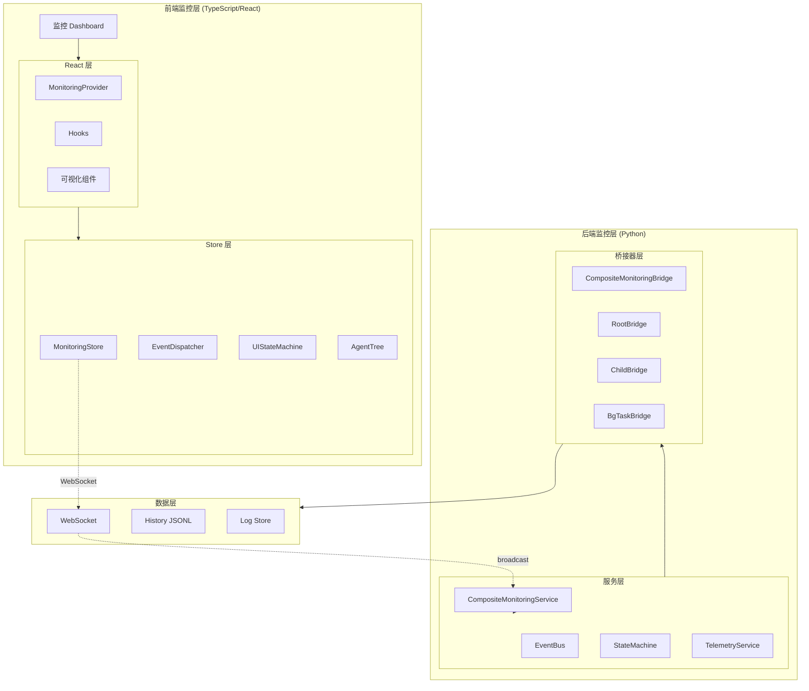

# 智能体监控系统设计文档 (面向对象架构)

## 概述

基于面向对象设计原则，构建一个完整的智能体监控系统，实现前端对后端智能体工作过程的完全透明化监控。

---

## 1. 架构总览



---

## 2. 后端面向对象设计

### 2.1 核心领域模型

```python
# agents/monitoring/domain/event.py

from dataclasses import dataclass, field
from datetime import datetime
from enum import Enum, auto
from typing import Any, Optional
from uuid import UUID, uuid4


class EventPriority(Enum):
    """事件优先级"""
    CRITICAL = 0
    HIGH = 1
    NORMAL = 2
    LOW = 3


class EventType(Enum):
    """事件类型枚举"""
    # Agent 生命周期
    AGENT_STARTED = "agent:started"
    AGENT_STOPPED = "agent:stopped"
    AGENT_ERROR = "agent:error"
    AGENT_PAUSED = "agent:paused"
    AGENT_RESUMED = "agent:resumed"

    # 消息流
    MESSAGE_START = "message:start"
    MESSAGE_DELTA = "message:delta"
    MESSAGE_COMPLETE = "message:complete"
    REASONING_DELTA = "reasoning:delta"

    # 工具调用
    TOOL_CALL_START = "tool_call:start"
    TOOL_CALL_END = "tool_call:end"
    TOOL_CALL_ERROR = "tool_call:error"
    TOOL_RESULT = "tool:result"

    # 子智能体
    SUBAGENT_SPAWNED = "subagent:spawned"
    SUBAGENT_STARTED = "subagent:started"
    SUBAGENT_PROGRESS = "subagent:progress"
    SUBAGENT_COMPLETED = "subagent:completed"
    SUBAGENT_FAILED = "subagent:failed"

    # 后台任务
    BG_TASK_QUEUED = "bg_task:queued"
    BG_TASK_STARTED = "bg_task:started"
    BG_TASK_PROGRESS = "bg_task:progress"
    BG_TASK_COMPLETED = "bg_task:completed"
    BG_TASK_FAILED = "bg_task:failed"

    # 状态机
    STATE_TRANSITION = "state:transition"
    STATE_ENTER = "state:enter"
    STATE_EXIT = "state:exit"

    # 资源使用
    TOKEN_USAGE = "metrics:tokens"
    MEMORY_USAGE = "metrics:memory"
    LATENCY_METRIC = "metrics:latency"


@dataclass(frozen=True)
class MonitoringEvent:
    """
    监控事件值对象

    特性:
    - 不可变性 (frozen=True)
    - 唯一标识 (UUID)
    - 层级关系 (parent_id)
    """
    type: EventType
    dialog_id: str
    source: str
    context_id: UUID
    timestamp: datetime = field(default_factory=datetime.utcnow)
    id: UUID = field(default_factory=uuid4)
    parent_id: Optional[UUID] = None
    priority: EventPriority = EventPriority.NORMAL
    payload: dict[str, Any] = field(default_factory=dict)
    metadata: dict[str, Any] = field(default_factory=dict)

    def is_child_of(self, parent: 'MonitoringEvent') -> bool:
        """检查是否为指定事件的子事件"""
        return self.parent_id == parent.id

    def get_duration_ms(self, since: datetime) -> int:
        """计算自指定时间以来的毫秒数"""
        return int((self.timestamp - since).total_seconds() * 1000)

    def to_dict(self) -> dict:
        """序列化为字典"""
        return {
            "id": str(self.id),
            "type": self.type.value,
            "dialog_id": self.dialog_id,
            "timestamp": self.timestamp.isoformat(),
            "source": self.source,
            "context_id": str(self.context_id),
            "parent_id": str(self.parent_id) if self.parent_id else None,
            "priority": self.priority.value,
            "payload": self.payload,
            "metadata": self.metadata,
        }

    @classmethod
    def create_child(
        cls,
        parent: 'MonitoringEvent',
        type: EventType,
        payload: dict[str, Any]
    ) -> 'MonitoringEvent':
        """工厂方法：创建子事件"""
        return cls(
            type=type,
            dialog_id=parent.dialog_id,
            source=parent.source,
            context_id=parent.context_id,
            parent_id=parent.id,
            payload=payload
        )
```

### 2.2 事件总线服务 (Observer 模式)

```python
# agents/monitoring/services/event_bus.py

import asyncio
from abc import ABC, abstractmethod
from typing import Callable, List, Dict, Optional
from dataclasses import dataclass
from loguru import logger

from ..domain.event import MonitoringEvent, EventPriority


class EventObserver(ABC):
    """事件观察者接口"""

    @abstractmethod
    async def on_event(self, event: MonitoringEvent) -> None:
        raise NotImplementedError


@dataclass
class EventHandler:
    """事件处理器"""
    can_handle: Callable[[MonitoringEvent], bool]
    handle: Callable[[MonitoringEvent], None]


class EventBus:
    """
    事件总线

    职责:
    - 事件分发
    - 观察者管理
    - 处理器路由
    - 优先级队列
    """

    def __init__(self):
        self._queue: asyncio.PriorityQueue = asyncio.PriorityQueue()
        self._observers: Dict[str, List[EventObserver]] = {}
        self._global_observers: List[EventObserver] = []
        self._handlers: List[EventHandler] = []
        self._running: bool = False
        self._websocket_handler: Optional[Callable] = None

    async def emit(self, event: MonitoringEvent) -> None:
        """发布事件到优先级队列"""
        await self._queue.put((
            event.priority.value,
            event.timestamp.timestamp(),
            event
        ))

    async def start_processing(self) -> None:
        """启动事件处理循环"""
        self._running = True
        while self._running:
            try:
                priority, timestamp, event = await asyncio.wait_for(
                    self._queue.get(), timeout=1.0
                )
                await self._dispatch(event)
            except asyncio.TimeoutError:
                continue

    async def _dispatch(self, event: MonitoringEvent) -> None:
        """分发事件到所有观察者"""
        # WebSocket 广播
        if self._websocket_handler:
            await self._websocket_handler(event)

        # 特定类型观察者
        for observer in self._observers.get(event.type.value, []):
            try:
                await observer.on_event(event)
            except Exception as e:
                logger.error(f"Observer error: {e}")

        # 全局观察者
        for observer in self._global_observers:
            try:
                await observer.on_event(event)
            except Exception as e:
                logger.error(f"Global observer error: {e}")

        # 处理器路由
        for handler in self._handlers:
            if handler.can_handle(event):
                handler.handle(event)

    def subscribe(
        self,
        observer: EventObserver,
        event_type: Optional[str] = None
    ) -> None:
        """订阅事件"""
        if event_type:
            if event_type not in self._observers:
                self._observers[event_type] = []
            self._observers[event_type].append(observer)
        else:
            self._global_observers.append(observer)

    def add_handler(self, handler: EventHandler) -> None:
        """添加处理器"""
        self._handlers.append(handler)

    def set_websocket_handler(self, handler: Callable) -> None:
        """设置 WebSocket 处理器"""
        self._websocket_handler = handler
```

### 2.3 状态机服务

```python
# agents/monitoring/services/state_machine.py

from enum import Enum, auto
from dataclasses import dataclass, field
from datetime import datetime
from typing import Optional, Callable, Dict, List
import asyncio


class AgentState(Enum):
    """Agent 状态枚举"""
    IDLE = "idle"
    INITIALIZING = "initializing"
    THINKING = "thinking"
    TOOL_CALLING = "tool_calling"
    WAITING_FOR_TOOL = "waiting_for_tool"
    SUBAGENT_RUNNING = "subagent_running"
    BACKGROUND_TASKS = "background_tasks"
    PAUSED = "paused"
    COMPLETED = "completed"
    ERROR = "error"


@dataclass
class StateTransition:
    """状态转换记录"""
    from_state: AgentState
    to_state: AgentState
    timestamp: datetime = field(default_factory=datetime.utcnow)
    trigger: Optional[str] = None
    duration_ms: Optional[int] = None
    guard_result: Optional[bool] = None


class StateMachine:
    """
    层级状态机

    职责:
    - 状态管理
    - 转换守卫
    - 历史记录
    """

    def __init__(self, dialog_id: str, event_bus: 'EventBus'):
        self._dialog_id = dialog_id
        self._event_bus = event_bus
        self._current_state = AgentState.IDLE
        self._history: List[StateTransition] = []
        self._entered_at = datetime.utcnow()
        self._transitions: Dict[tuple[AgentState, AgentState], List[Callable]] = {}
        self._guards: Dict[tuple[AgentState, AgentState], Callable] = {}
        self._lock = asyncio.Lock()

    def add_transition(
        self,
        from_state: AgentState,
        to_state: AgentState,
        on_transition: Optional[Callable] = None,
        guard: Optional[Callable] = None
    ) -> None:
        """添加状态转换规则"""
        key = (from_state, to_state)
        if key not in self._transitions:
            self._transitions[key] = []
        if on_transition:
            self._transitions[key].append(on_transition)
        if guard:
            self._guards[key] = guard

    async def transition(
        self,
        to_state: AgentState,
        trigger: Optional[str] = None
    ) -> bool:
        """执行状态转换"""
        async with self._lock:
            from_state = self._current_state
            key = (from_state, to_state)

            # 检查守卫条件
            if key in self._guards:
                if not await self._guards[key]():
                    return False

            # 计算持续时间
            duration_ms = int(
                (datetime.utcnow() - self._entered_at).total_seconds() * 1000
            )

            # 执行转换动作
            if key in self._transitions:
                for action in self._transitions[key]:
                    await action(from_state, to_state)

            # 记录转换
            transition = StateTransition(
                from_state=from_state,
                to_state=to_state,
                trigger=trigger,
                duration_ms=duration_ms,
                guard_result=True
            )
            self._history.append(transition)

            # 更新状态
            self._current_state = to_state
            self._entered_at = datetime.utcnow()

            return True

    def get_current_state(self) -> AgentState:
        return self._current_state

    def get_history(self) -> List[StateTransition]:
        return list(self._history)

    def get_time_in_state_ms(self) -> int:
        return int(
            (datetime.utcnow() - self._entered_at).total_seconds() * 1000
        )
```

### 2.4 监控桥接器层次

```python
# agents/monitoring/bridge/base.py

from abc import ABC, abstractmethod
from typing import Any, Optional, Dict
from uuid import UUID, uuid4

from ..domain.event import MonitoringEvent, EventType
from ..services.event_bus import EventBus
from ..services.state_machine import StateMachine, AgentState


class IMonitoringBridge(ABC):
    """监控桥接器接口"""

    @abstractmethod
    def get_dialog_id(self) -> str:
        raise NotImplementedError

    @abstractmethod
    def get_agent_name(self) -> str:
        raise NotImplementedError

    @abstractmethod
    def get_bridge_id(self) -> UUID:
        raise NotImplementedError

    @abstractmethod
    async def emit_event(self, event: MonitoringEvent) -> None:
        raise NotImplementedError


class BaseMonitoringBridge(IMonitoringBridge):
    """
    监控桥接器抽象基类

    实现共用功能，子类只需关注特定逻辑
    """

    def __init__(
        self,
        dialog_id: str,
        agent_name: str,
        event_bus: EventBus,
        parent: Optional['BaseMonitoringBridge'] = None
    ):
        self._dialog_id = dialog_id
        self._agent_name = agent_name
        self._bridge_id = uuid4()
        self._event_bus = event_bus
        self._state_machine = StateMachine(dialog_id, event_bus)
        self._parent = parent
        self._initialized = False

    async def initialize(self) -> None:
        """初始化模板方法"""
        if self._initialized:
            return
        await self._do_initialize()
        self._initialized = True
        await self._emit(EventType.AGENT_STARTED, {
            "bridge_id": str(self._bridge_id),
            "agent_name": self._agent_name
        })

    async def _do_initialize(self) -> None:
        """子类覆盖的初始化逻辑"""
        pass

    async def _emit(
        self,
        event_type: EventType,
        payload: Dict[str, Any],
        parent_event: Optional[MonitoringEvent] = None
    ) -> MonitoringEvent:
        """发送事件"""
        if parent_event:
            event = MonitoringEvent.create_child(
                parent_event, event_type, payload
            )
        else:
            event = MonitoringEvent(
                type=event_type,
                dialog_id=self._dialog_id,
                source=self._agent_name,
                context_id=self._bridge_id,
                payload=payload
            )
        await self._event_bus.emit(event)
        return event

    async def _transition_state(self, state: AgentState) -> None:
        """状态转换"""
        await self._state_machine.transition(state)

    # IMonitoringBridge 实现
    def get_dialog_id(self) -> str:
        return self._dialog_id

    def get_agent_name(self) -> str:
        return self._agent_name

    def get_bridge_id(self) -> UUID:
        return self._bridge_id

    async def emit_event(self, event: MonitoringEvent) -> None:
        await self._event_bus.emit(event)
```

### 2.5 组合桥接器 (Composite 模式)

```python
# agents/monitoring/bridge/composite.py

from typing import Dict, Optional
from uuid import UUID

from .base import BaseMonitoringBridge, IMonitoringBridge
from .child import ChildMonitoringBridge
from .background import BackgroundTaskBridge
from ..services.event_bus import EventBus
from ..domain.event import EventType


class CompositeMonitoringBridge(BaseMonitoringBridge):
    """
    组合监控桥接器

    管理子智能体和后台任务的创建与生命周期
    """

    def __init__(
        self,
        dialog_id: str,
        agent_name: str,
        event_bus: EventBus
    ):
        super().__init__(dialog_id, agent_name, event_bus)
        self._children: Dict[UUID, IMonitoringBridge] = {}
        self._active_subagent: Optional[UUID] = None

    def create_subagent_bridge(
        self,
        subagent_name: str,
        subagent_type: str = "Explore"
    ) -> ChildMonitoringBridge:
        """创建子智能体桥接器"""
        subagent_id = f"{self._dialog_id}_{subagent_name}_{uuid4().hex[:8]}"

        child = ChildMonitoringBridge(
            dialog_id=subagent_id,
            agent_name=subagent_name,
            event_bus=self._event_bus,
            parent=self,
            subagent_type=subagent_type
        )

        self._children[child.get_bridge_id()] = child
        self._active_subagent = child.get_bridge_id()

        # 异步发送 spawned 事件
        import asyncio
        asyncio.create_task(self._emit(
            EventType.SUBAGENT_SPAWNED,
            {
                "subagent_id": str(child.get_bridge_id()),
                "subagent_name": subagent_name,
                "subagent_type": subagent_type,
                "parent_bridge_id": str(self._bridge_id)
            }
        ))

        return child

    def create_background_task_bridge(
        self,
        task_id: str,
        command: str
    ) -> BackgroundTaskBridge:
        """创建后台任务桥接器"""
        task = BackgroundTaskBridge(
            dialog_id=self._dialog_id,
            task_id=task_id,
            command=command,
            event_bus=self._event_bus,
            parent=self
        )

        self._children[task.get_bridge_id()] = task
        return task

    def get_child(self, bridge_id: UUID) -> Optional[IMonitoringBridge]:
        """获取子桥接器"""
        return self._children.get(bridge_id)

    def get_all_bridges(self) -> Dict[UUID, IMonitoringBridge]:
        """获取所有桥接器（包括自己）"""
        result = {self._bridge_id: self}
        result.update(self._children)
        return result
```

---

## 3. 前端面向对象设计

### 3.1 核心领域模型

```typescript
// web/src/monitoring/domain/Event.ts

export enum EventPriority {
  CRITICAL = 0,
  HIGH = 1,
  NORMAL = 2,
  LOW = 3
}

export enum EventType {
  AGENT_STARTED = 'agent:started',
  AGENT_STOPPED = 'agent:stopped',
  MESSAGE_DELTA = 'message:delta',
  REASONING_DELTA = 'reasoning:delta',
  SUBAGENT_SPAWNED = 'subagent:spawned',
  SUBAGENT_COMPLETED = 'subagent:completed',
  BG_TASK_QUEUED = 'bg_task:queued',
  BG_TASK_PROGRESS = 'bg_task:progress',
  STATE_TRANSITION = 'state:transition',
  TOKEN_USAGE = 'metrics:tokens'
}

export class MonitoringEvent {
  private readonly _id: string;
  private readonly _type: EventType;
  private readonly _timestamp: Date;
  private readonly _source: string;
  private readonly _dialogId: string;
  private readonly _contextId: string;
  private readonly _parentId?: string;
  private readonly _priority: EventPriority;
  private readonly _payload: Record<string, unknown>;
  private readonly _metadata: Record<string, unknown>;

  constructor(params: {
    id?: string;
    type: EventType;
    timestamp?: Date;
    source: string;
    dialogId: string;
    contextId: string;
    parentId?: string;
    priority?: EventPriority;
    payload?: Record<string, unknown>;
    metadata?: Record<string, unknown>;
  }) {
    this._id = params.id ?? crypto.randomUUID();
    this._type = params.type;
    this._timestamp = params.timestamp ?? new Date();
    this._source = params.source;
    this._dialogId = params.dialogId;
    this._contextId = params.contextId;
    this._parentId = params.parentId;
    this._priority = params.priority ?? EventPriority.NORMAL;
    this._payload = params.payload ?? {};
    this._metadata = params.metadata ?? {};
  }

  // Getters
  get id(): string { return this._id; }
  get type(): EventType { return this._type; }
  get timestamp(): Date { return this._timestamp; }
  get source(): string { return this._source; }
  get dialogId(): string { return this._dialogId; }
  get contextId(): string { return this._contextId; }
  get parentId(): string | undefined { return this._parentId; }
  get priority(): EventPriority { return this._priority; }
  get payload(): Record<string, unknown> { return this._payload; }
  get metadata(): Record<string, unknown> { return this._metadata; }

  // Business methods
  isChildOf(parent: MonitoringEvent): boolean {
    return this._parentId === parent.id;
  }

  getDurationMs(since: Date): number {
    return this._timestamp.getTime() - since.getTime();
  }

  toJSON(): object {
    return {
      id: this._id,
      type: this._type,
      timestamp: this._timestamp.toISOString(),
      source: this._source,
      dialogId: this._dialogId,
      contextId: this._contextId,
      parentId: this._parentId,
      priority: this._priority,
      payload: this._payload,
      metadata: this._metadata
    };
  }

  // Factory method
  static fromWebSocket(data: unknown): MonitoringEvent {
    const parsed = data as Record<string, unknown>;
    return new MonitoringEvent({
      id: parsed.id as string,
      type: parsed.type as EventType,
      timestamp: new Date(parsed.timestamp as string),
      source: parsed.source as string,
      dialogId: parsed.dialogId as string,
      contextId: parsed.contextId as string,
      parentId: parsed.parentId as string | undefined,
      priority: parsed.priority as EventPriority,
      payload: parsed.payload as Record<string, unknown>,
      metadata: parsed.metadata as Record<string, unknown>
    });
  }

  static createChild(
    parent: MonitoringEvent,
    type: EventType,
    payload: Record<string, unknown>
  ): MonitoringEvent {
    return new MonitoringEvent({
      type,
      source: parent.source,
      dialogId: parent.dialogId,
      contextId: parent.contextId,
      parentId: parent.id,
      payload
    });
  }
}
```

### 3.2 Agent 层级节点

```typescript
// web/src/monitoring/domain/AgentNode.ts

export type AgentType = 'root' | 'subagent' | 'background_task';

export enum AgentState {
  IDLE = 'idle',
  INITIALIZING = 'initializing',
  THINKING = 'thinking',
  TOOL_CALLING = 'tool_calling',
  SUBAGENT_RUNNING = 'subagent_running',
  BACKGROUND_TASKS = 'background_tasks',
  PAUSED = 'paused',
  COMPLETED = 'completed',
  ERROR = 'error'
}

export interface PerformanceMetrics {
  tokenCount: { input: number; output: number };
  toolCalls: number;
  subagentCalls: number;
  latencyMs: number[];
  startTime?: Date;
  endTime?: Date;
}

export class AgentNode {
  private _id: string;
  private _name: string;
  private _type: AgentType;
  private _status: AgentState;
  private _startTime: Date;
  private _endTime?: Date;
  private _metrics: PerformanceMetrics;
  private _parent?: AgentNode;
  private _children: AgentNode[];
  private _events: MonitoringEvent[];

  constructor(params: {
    id: string;
    name: string;
    type: AgentType;
    status?: AgentState;
    startTime: Date;
    parent?: AgentNode;
  }) {
    this._id = params.id;
    this._name = params.name;
    this._type = params.type;
    this._status = params.status ?? AgentState.IDLE;
    this._startTime = params.startTime;
    this._parent = params.parent;
    this._children = [];
    this._events = [];
    this._metrics = {
      tokenCount: { input: 0, output: 0 },
      toolCalls: 0,
      subagentCalls: 0,
      latencyMs: []
    };

    if (params.parent) {
      params.parent.addChild(this);
    }
  }

  // Hierarchy operations
  addChild(child: AgentNode): void {
    this._children.push(child);
    child._parent = this;
  }

  removeChild(childId: string): boolean {
    const index = this._children.findIndex(c => c._id === childId);
    if (index >= 0) {
      this._children.splice(index, 1);
      return true;
    }
    return false;
  }

  findById(id: string): AgentNode | undefined {
    if (this._id === id) return this;
    for (const child of this._children) {
      const found = child.findById(id);
      if (found) return found;
    }
    return undefined;
  }

  findByPredicate(predicate: (node: AgentNode) => boolean): AgentNode | undefined {
    if (predicate(this)) return this;
    for (const child of this._children) {
      const found = child.findByPredicate(predicate);
      if (found) return found;
    }
    return undefined;
  }

  getDepth(): number {
    let depth = 0;
    let current: AgentNode | undefined = this._parent;
    while (current) {
      depth++;
      current = current._parent;
    }
    return depth;
  }

  getSiblings(): AgentNode[] {
    if (!this._parent) return [];
    return this._parent._children.filter(c => c._id !== this._id);
  }

  getPath(): string[] {
    const path: string[] = [this._id];
    let current: AgentNode | undefined = this._parent;
    while (current) {
      path.unshift(current._id);
      current = current._parent;
    }
    return path;
  }

  // State transitions
  transitionState(newState: AgentState): void {
    this._status = newState;
  }

  complete(): void {
    this._status = AgentState.COMPLETED;
    this._endTime = new Date();
  }

  fail(error?: string): void {
    this._status = AgentState.ERROR;
    this._endTime = new Date();
    if (error) {
      this._metadata = { ...this._metadata, error };
    }
  }

  // Event association
  attachEvent(event: MonitoringEvent): void {
    this._events.push(event);
  }

  getEvents(type?: EventType): MonitoringEvent[] {
    if (!type) return [...this._events];
    return this._events.filter(e => e.type === type);
  }

  getLatestEvent(): MonitoringEvent | undefined {
    return this._events[this._events.length - 1];
  }

  // Serialization
  toTree(): TreeNode<AgentNode> {
    return {
      data: this,
      children: this._children.map(c => c.toTree())
    };
  }

  toFlatList(): AgentNode[] {
    const list: AgentNode[] = [this];
    for (const child of this._children) {
      list.push(...child.toFlatList());
    }
    return list;
  }

  // Getters
  get id(): string { return this._id; }
  get name(): string { return this._name; }
  get type(): AgentType { return this._type; }
  get status(): AgentState { return this._status; }
  get startTime(): Date { return this._startTime; }
  get endTime(): Date | undefined { return this._endTime; }
  get metrics(): PerformanceMetrics { return this._metrics; }
  get parent(): AgentNode | undefined { return this._parent; }
  get children(): AgentNode[] { return [...this._children]; }
}

export interface TreeNode<T> {
  data: T;
  children: TreeNode<T>[];
}
```

### 3.3 Store 核心类

```typescript
// web/src/monitoring/store/MonitoringStore.ts

import { EventDispatcher } from '../services/EventDispatcher';
import { UIStateMachine } from '../services/UIStateMachine';
import { MetricsCollector } from '../services/MetricsCollector';
import { WebSocketEventAdapter } from '../services/WebSocketEventAdapter';
import { MonitoringEvent, EventType } from '../domain/Event';
import { AgentNode, AgentState, TreeNode } from '../domain/AgentNode';

export type StateSelector<T> = (store: MonitoringStore) => T;
export type StoreSubscriber = {
  selector: StateSelector<unknown>;
  callback: (current: unknown, previous: unknown) => void;
  lastValue: unknown;
};

export interface StoreServices {
  dispatcher: EventDispatcher;
  stateMachine: UIStateMachine;
  metricsCollector: MetricsCollector;
  wsAdapter: WebSocketEventAdapter;
}

export class MonitoringStore {
  // Dependencies
  private _dispatcher: EventDispatcher;
  private _stateMachine: UIStateMachine;
  private _metricsCollector: MetricsCollector;
  private _wsAdapter: WebSocketEventAdapter;

  // State data
  private _rootAgent: AgentNode | null = null;
  private _activeAgentId: string | null = null;
  private _events: Map<string, MonitoringEvent> = new Map();
  private _streamingContent: string = '';
  private _streamingReasoning: string = '';
  private _subscribers: Set<StoreSubscriber> = new Set();

  constructor(services: StoreServices) {
    this._dispatcher = services.dispatcher;
    this._stateMachine = services.stateMachine;
    this._metricsCollector = services.metricsCollector;
    this._wsAdapter = services.wsAdapter;
    this._setupEventHandlers();
  }

  private _setupEventHandlers(): void {
    this._dispatcher.subscribe({
      onEvent: (event: MonitoringEvent) => this._handleEvent(event)
    });
  }

  private _handleEvent(event: MonitoringEvent): void {
    // Save event
    this._events.set(event.id, event);

    // Route by type
    switch (event.type) {
      case EventType.AGENT_STARTED:
        this._handleAgentStarted(event);
        break;
      case EventType.SUBAGENT_SPAWNED:
        this._handleSubagentSpawned(event);
        break;
      case EventType.MESSAGE_DELTA:
        this._handleMessageDelta(event);
        break;
      case EventType.REASONING_DELTA:
        this._handleReasoningDelta(event);
        break;
      case EventType.STATE_TRANSITION:
        this._handleStateTransition(event);
        break;
      case EventType.SUBAGENT_COMPLETED:
        this._handleSubagentCompleted(event);
        break;
    }

    // Notify subscribers
    this._notifySubscribers(event);
  }

  private _handleAgentStarted(event: MonitoringEvent): void {
    const { agentName, bridgeId } = event.payload as { agentName: string; bridgeId: string };
    this._rootAgent = new AgentNode({
      id: bridgeId,
      name: agentName,
      type: 'root',
      startTime: event.timestamp
    });
    this._activeAgentId = bridgeId;
    this._stateMachine.transition(AgentState.INITIALIZING);
  }

  private _handleSubagentSpawned(event: MonitoringEvent): void {
    const { subagentId, subagentName, parentBridgeId } = event.payload as {
      subagentId: string;
      subagentName: string;
      parentBridgeId: string;
    };

    const parent = this._rootAgent?.findById(parentBridgeId);
    if (!parent) return;

    const child = new AgentNode({
      id: subagentId,
      name: subagentName,
      type: 'subagent',
      parent,
      startTime: event.timestamp
    });

    this._activeAgentId = subagentId;
  }

  private _handleMessageDelta(event: MonitoringEvent): void {
    const { delta } = event.payload as { delta: string };
    this._streamingContent += delta;
  }

  private _handleReasoningDelta(event: MonitoringEvent): void {
    const { delta } = event.payload as { delta: string };
    this._streamingReasoning += delta;
  }

  private _handleStateTransition(event: MonitoringEvent): void {
    const { to_state } = event.payload as { to_state: AgentState };
    this._stateMachine.transition(to_state);
  }

  private _handleSubagentCompleted(event: MonitoringEvent): void {
    const { subagentId } = event.payload as { subagentId: string };
    const subagent = this._rootAgent?.findById(subagentId);
    if (subagent) {
      subagent.complete();
    }
    if (this._activeAgentId === subagentId) {
      this._activeAgentId = this._rootAgent?.id ?? null;
    }
  }

  private _notifySubscribers(event: MonitoringEvent): void {
    for (const subscriber of this._subscribers) {
      const currentValue = subscriber.selector(this);
      if (currentValue !== subscriber.lastValue) {
        subscriber.callback(currentValue, subscriber.lastValue);
        subscriber.lastValue = currentValue;
      }
    }
  }

  // Public API
  getAgentHierarchy(): TreeNode<AgentNode> | null {
    return this._rootAgent?.toTree() ?? null;
  }

  getStreamingContent(): { content: string; reasoning: string } {
    return {
      content: this._streamingContent,
      reasoning: this._streamingReasoning
    };
  }

  getAgentState(): AgentState {
    return this._stateMachine.getCurrentState();
  }

  getActiveAgentId(): string | null {
    return this._activeAgentId;
  }

  getEventById(id: string): MonitoringEvent | undefined {
    return this._events.get(id);
  }

  getAllEvents(): MonitoringEvent[] {
    return Array.from(this._events.values());
  }

  // Subscription
  subscribe<T>(
    selector: StateSelector<T>,
    callback: (current: T, previous: T) => void
  ): () => void {
    const subscriber: StoreSubscriber = {
      selector: selector as StateSelector<unknown>,
      callback: callback as (current: unknown, previous: unknown) => void,
      lastValue: undefined
    };
    this._subscribers.add(subscriber);
    return () => this._subscribers.delete(subscriber);
  }

  // Cleanup
  destroy(): void {
    this._wsAdapter.disconnect();
    this._subscribers.clear();
  }
}
```

### 3.4 React 集成

```typescript
// web/src/monitoring/react/MonitoringProvider.tsx

import React, { createContext, useContext, useMemo, useCallback } from 'react';
import { useSyncExternalStore } from 'react';
import { MonitoringStore, StateSelector } from '../store/MonitoringStore';
import { createDefaultServices } from '../services/factory';
import { AgentNode, AgentState, TreeNode } from '../domain/AgentNode';

const MonitoringContext = createContext<MonitoringStore | null>(null);

export interface MonitoringProviderProps {
  children: React.ReactNode;
  dialogId: string;
}

export function MonitoringProvider({ children, dialogId }: MonitoringProviderProps) {
  const store = useMemo(() => {
    const services = createDefaultServices(dialogId);
    return new MonitoringStore(services);
  }, [dialogId]);

  return (
    <MonitoringContext.Provider value={store}>
      {children}
    </MonitoringContext.Provider>
  );
}

export function useMonitoringStore(): MonitoringStore {
  const store = useContext(MonitoringContext);
  if (!store) {
    throw new Error('useMonitoringStore must be used within MonitoringProvider');
  }
  return store;
}

// Convenience hooks
export function useAgentHierarchy(): TreeNode<AgentNode> | null {
  const store = useMonitoringStore();
  return useSyncExternalStore(
    useCallback((cb) => store.subscribe(s => s.getAgentHierarchy(), cb), [store]),
    () => store.getAgentHierarchy()
  );
}

export function useAgentState(): AgentState {
  const store = useMonitoringStore();
  return useSyncExternalStore(
    useCallback((cb) => store.subscribe(s => s.getAgentState(), cb), [store]),
    () => store.getAgentState()
  );
}

export function useStreamingContent(): { content: string; reasoning: string } {
  const store = useMonitoringStore();
  return useSyncExternalStore(
    useCallback((cb) => store.subscribe(s => s.getStreamingContent(), cb), [store]),
    () => store.getStreamingContent()
  );
}

export function useActiveAgentId(): string | null {
  const store = useMonitoringStore();
  return useSyncExternalStore(
    useCallback((cb) => store.subscribe(s => s.getActiveAgentId(), cb), [store]),
    () => store.getActiveAgentId()
  );
}
```

---

## 4. 前后端对应关系

| 后端 (Python) | 前端 (TypeScript) | 职责 | 同步机制 |
|--------------|------------------|------|---------|
| `MonitoringEvent` | `MonitoringEvent` | 事件值对象 | WebSocket JSON |
| `EventBus` | `EventDispatcher` | 事件分发 | 消息推送 |
| `StateMachine` | `UIStateMachine` | 状态管理 | state事件 |
| `AgentHierarchy` | `AgentTree` | 层级关系 | 事件同步 |
| `TelemetryMetric` | `PerformanceMetrics` | 性能指标 | metrics事件 |
| `CompositeMonitoringBridge` | `MonitoringStore` | 组合服务 | 完整同步 |

---

## 5. 设计原则应用

### SOLID 原则

| 原则 | 应用 |
|------|------|
| **S**ingle Responsibility | Event 只负责数据，EventBus 只负责分发，Handler 只负责处理 |
| **O**pen/Closed | 新增 EventHandlerStrategy 无需修改 EventBus |
| **L**iskov Substitution | ChildBridge 可以完全替换 BaseMonitoringBridge |
| **I**nterface Segregation | IMonitoringBridge 只暴露必要方法 |
| **D**ependency Inversion | BaseMonitoringBridge 依赖 EventBus 抽象 |

### 设计模式

| 模式 | 应用位置 |
|------|---------|
| Observer | EventObserver 订阅 EventBus |
| Strategy | EventHandlerStrategy 可插拔处理器 |
| Composite | CompositeBridge 管理多个子 Bridge |
| Template Method | MonitoringService 定义初始化/关闭流程 |
| Factory | MonitoringEvent.createChild 工厂方法 |
| Singleton | EventBus 全局唯一实例 |

---

## 6. 后续任务清单

### 阶段 1: 后端基础设施 (优先级: P0)

- [ ] **TASK-001**: 实现 `MonitoringEvent` 领域模型
  - 文件: `agents/monitoring/domain/event.py`
  - 要点: 不可变值对象、UUID、层级关系

- [ ] **TASK-002**: 实现 `EventBus` 事件总线
  - 文件: `agents/monitoring/services/event_bus.py`
  - 要点: 优先级队列、观察者模式、异步处理

- [ ] **TASK-003**: 实现 `StateMachine` 状态机
  - 文件: `agents/monitoring/services/state_machine.py`
  - 要点: 状态转换、守卫条件、历史记录

- [ ] **TASK-004**: 实现 `BaseMonitoringBridge` 桥接器基类
  - 文件: `agents/monitoring/bridge/base.py`
  - 要点: IMonitoringBridge 接口、模板方法、事件发送

- [ ] **TASK-005**: 实现 `CompositeMonitoringBridge` 组合桥接器
  - 文件: `agents/monitoring/bridge/composite.py`
  - 要点: 子智能体管理、后台任务管理

### 阶段 2: 前端基础设施 (优先级: P0)

- [ ] **TASK-006**: 实现前端 `MonitoringEvent` 类
  - 文件: `web/src/monitoring/domain/Event.ts`
  - 要点: 与后端对应、工厂方法、序列化

- [ ] **TASK-007**: 实现 `AgentNode` 层级节点类
  - 文件: `web/src/monitoring/domain/AgentNode.ts`
  - 要点: 树形结构、查询方法、状态转换

- [ ] **TASK-008**: 实现 `EventDispatcher` 服务
  - 文件: `web/src/monitoring/services/EventDispatcher.ts`
  - 要点: 观察者模式、事件路由

- [ ] **TASK-009**: 实现 `MonitoringStore` 核心类
  - 文件: `web/src/monitoring/store/MonitoringStore.ts`
  - 要点: 与后端对应、状态管理、订阅机制

- [ ] **TASK-010**: 实现 React 集成层
  - 文件: `web/src/monitoring/react/MonitoringProvider.tsx`
  - 要点: Context Provider、Hooks、useSyncExternalStore

### 阶段 3: 后端高级功能 (优先级: P1)

- [ ] **TASK-011**: 实现 `BackgroundTaskBridge` 后台任务桥接器
  - 文件: `agents/monitoring/bridge/background.py`
  - 要点: 子进程监控、实时输出流

- [ ] **TASK-012**: 实现 `TelemetryService` 遥测服务
  - 文件: `agents/monitoring/services/telemetry.py`
  - 要点: 指标收集、聚合计算、时序数据

- [ ] **TASK-013**: 实现 `EventPersistence` 持久化
  - 文件: `agents/monitoring/persistence/jsonl_store.py`
  - 要点: JSONL 格式、按对话框存储、查询接口

- [ ] **TASK-014**: 实现 WebSocket 广播集成
  - 文件: `agents/websocket/broadcast.py`
  - 要点: 与 EventBus 集成、序列化、连接管理

### 阶段 4: 前端高级功能 (优先级: P1)

- [ ] **TASK-015**: 实现 `Timeline` 时间线类
  - 文件: `web/src/monitoring/domain/Timeline.ts`
  - 要点: 时间范围查询、过滤、排序

- [ ] **TASK-016**: 实现 `EventFilter` 事件过滤器
  - 文件: `web/src/monitoring/domain/EventFilter.ts`
  - 要点: 复杂查询条件、组合过滤

- [ ] **TASK-017**: 实现 Agent 层级可视化组件
  - 文件: `web/src/components/monitoring/AgentHierarchy.tsx`
  - 要点: 树形展示、状态指示、交互

- [ ] **TASK-018**: 实现状态机可视化组件
  - 文件: `web/src/components/monitoring/StateMachineViz.tsx`
  - 要点: 状态流转图、当前状态高亮

### 阶段 5: 集成与优化 (优先级: P2)

- [ ] **TASK-019**: 集成 SFullAgent 与监控桥接器
  - 文件: `agents/agent/s_full.py`
  - 要点: 替换现有桥接器、保持向后兼容

- [ ] **TASK-020**: 迁移现有 useWebSocket 到 MonitoringStore
  - 文件: `web/src/hooks/useWebSocket.ts`
  - 要点: 平滑迁移、功能兼容

- [ ] **TASK-021**: 性能优化 - 事件批处理
  - 文件: `agents/monitoring/services/event_bus.py`
  - 要点: Token 流批处理、防抖机制

- [ ] **TASK-022**: 性能优化 - 虚拟列表
  - 文件: `web/src/components/monitoring/TimelineView.tsx`
  - 要点: 长列表虚拟化、懒加载

### 阶段 6: 测试与文档 (优先级: P2)

- [ ] **TASK-023**: 后端单元测试
  - 覆盖: EventBus、StateMachine、Bridge

- [ ] **TASK-024**: 前端单元测试
  - 覆盖: Store、Domain、Services

- [ ] **TASK-025**: 集成测试
  - 覆盖: 前后端完整链路

- [ ] **TASK-026**: 编写使用文档
  - 内容: API 文档、集成指南、最佳实践

---

## 7. 文件结构

```
agents/monitoring/
├── __init__.py
├── domain/
│   ├── __init__.py
│   ├── event.py              # MonitoringEvent
│   └── metrics.py            # TelemetryMetric
├── services/
│   ├── __init__.py
│   ├── event_bus.py          # EventBus
│   ├── state_machine.py      # StateMachine
│   └── telemetry.py          # TelemetryService
├── bridge/
│   ├── __init__.py
│   ├── base.py               # BaseMonitoringBridge
│   ├── composite.py          # CompositeMonitoringBridge
│   ├── child.py              # ChildMonitoringBridge
│   └── background.py         # BackgroundTaskBridge
└── persistence/
    ├── __init__.py
    └── jsonl_store.py        # EventPersistence

web/src/monitoring/
├── index.ts
├── domain/
│   ├── Event.ts              # MonitoringEvent
│   ├── AgentNode.ts          # AgentNode
│   └── Timeline.ts           # Timeline
├── services/
│   ├── EventDispatcher.ts
│   ├── UIStateMachine.ts
│   ├── MetricsCollector.ts
│   ├── WebSocketEventAdapter.ts
│   └── factory.ts
├── store/
│   └── MonitoringStore.ts
└── react/
    ├── MonitoringProvider.tsx
    └── hooks.ts
```

---

**文档版本**: 1.0
**最后更新**: 2026-03-12
**作者**: Claude
