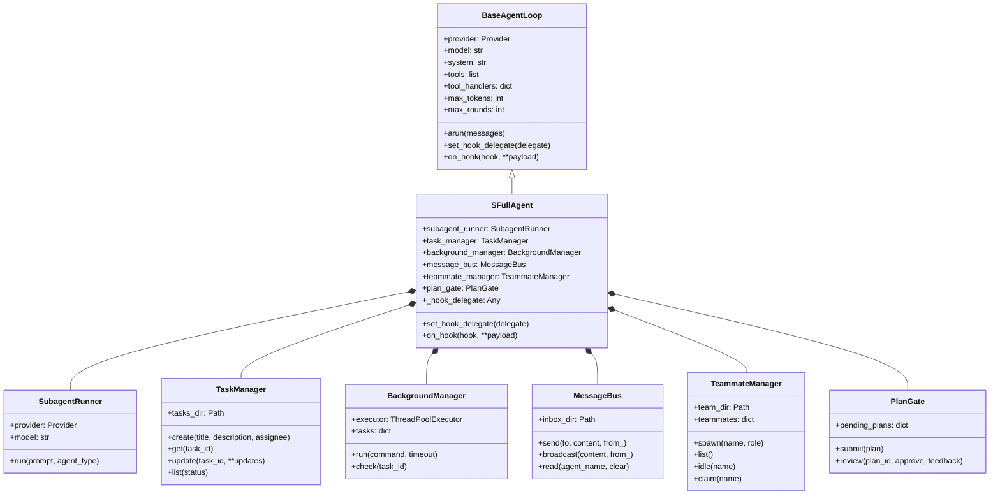
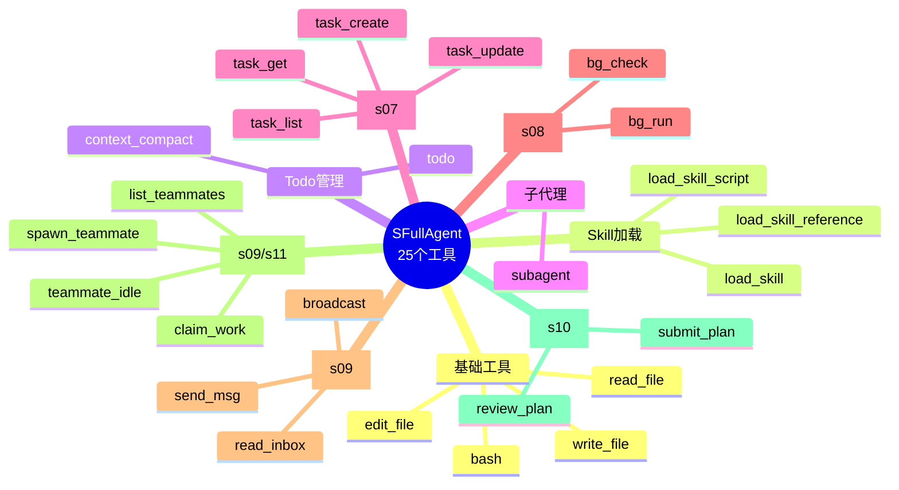
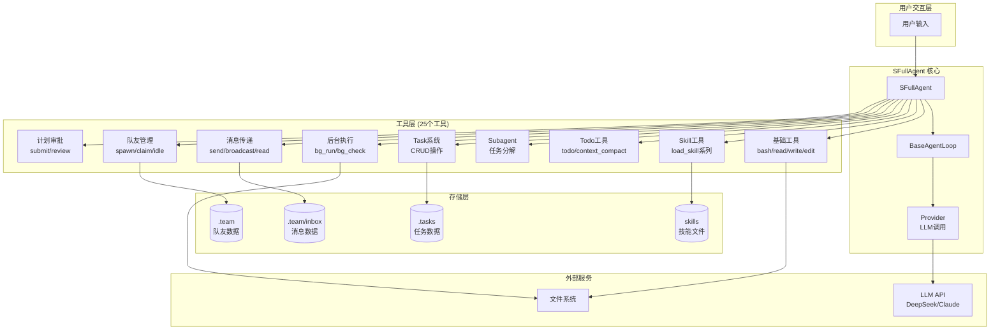
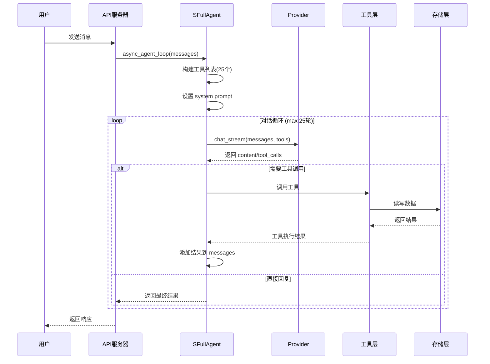
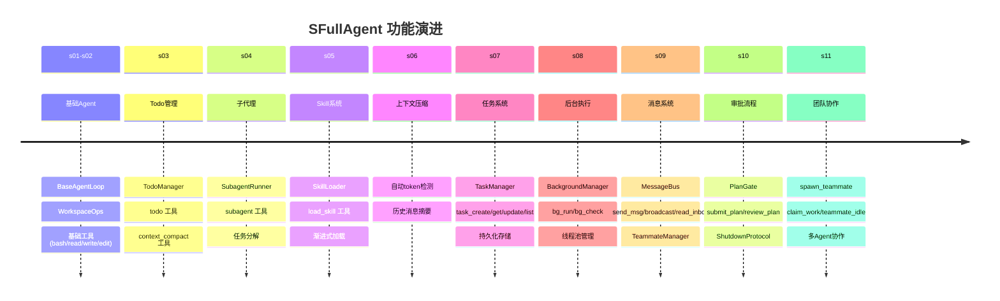
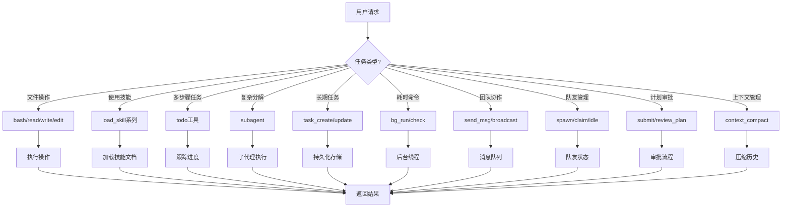

# SFullAgent 架构图

## 1. 类继承层次图



## 2. 工具分类架构图



## 3. 组件交互流程图



## 4. Agent 生命周期时序图



## 5. 功能演进路线图 (s01-s11)



## 6. 目录结构图

```mermaid
flowchart LR
    subgraph Root["项目根目录"]
        A[agents/]
        S[skills/]
        D1[.tasks/]
        D2[.team/]
        D3[.team/inbox/]
    end

    subgraph Agents["agents/"]
        B[base/]
        P[providers/]
        SA[s_full.py]
        direction TB
    end

    subgraph Base["agents/base/"]
        BL[abstract.py<br/>BaseAgentLoop]
        TO[toolkit.py<br/>@tool]
        WO[workspace.py<br/>WorkspaceOps]
    end

    subgraph Skills["skills/"]
        SK1[skill-a/]
        SK2[skill-b/]
        SK3[...]
    end

    A --> Agents
    A --> Skills
    Agents --> Base
    Root -.-> D1
    Root -.-> D2
    D2 -.-> D3
```

## 7. 工具调用决策树


